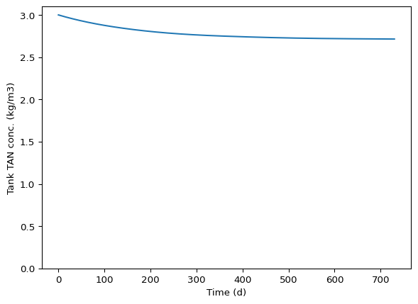
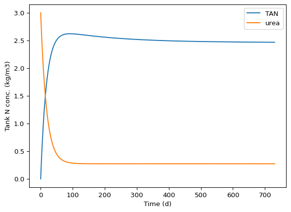
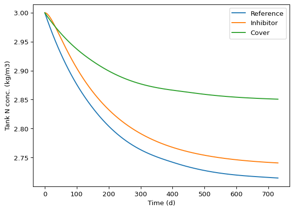
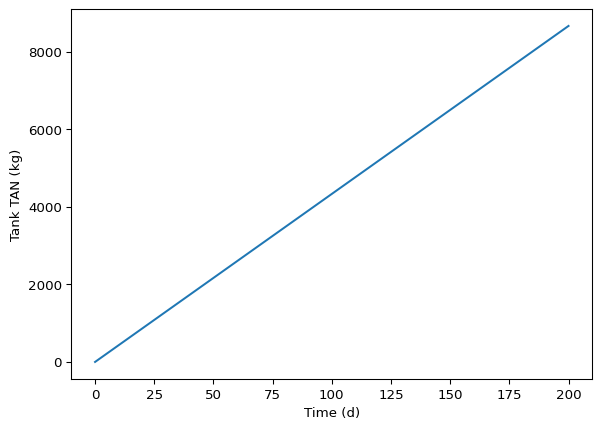
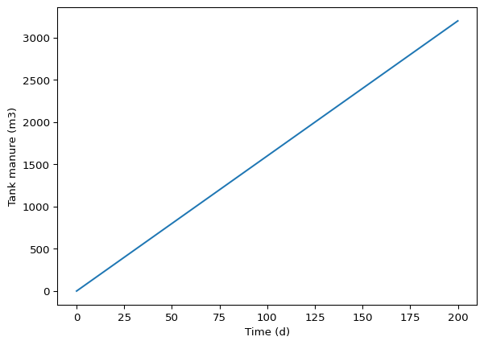
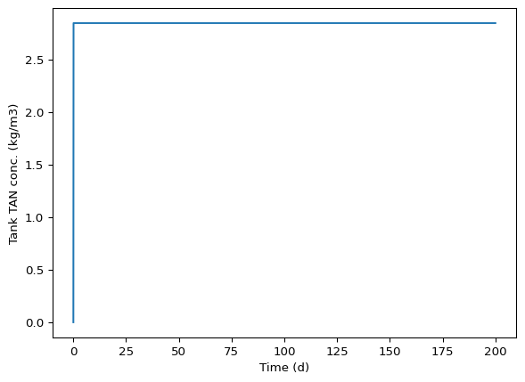

# Application of ammonia emission models
Modeling 2025 instructors

# 1. Overview

This document is meant to both apply and explain the ammonia
volatilization models defined in the `ammonia_mods.py` module. This mix
of text and code is written in a “Quarto Markdown” file with a `.qmd`
extension. That is just done to make it easy to mix text, Python code
and output, and figures. All the Python code here could be put in a
regular `.py` script and run line by line or all at one time. This
document is not meant to be an example report, but much of the content
would have been suitable for inclusion in a report.

# 2. Python prep

Import packages.

``` python
import numpy as np
import matplotlib.pyplot as plt
from importlib import reload
```

Import and name the user-defined module that has our emission models.

``` python
import ammonia_mods as am
```

For development of the model functions, use `reload()` every time the
pool_mods.py module is edited. You would not typically include this in a
final script that is meant to be shared with others, but you should use
it and it is fine to keep it in your submitted scripts in this class.

``` python
reload(am)
```

    <module 'ammonia_mods' from '/home/sasha/GitHub_repos/course-modelling-2025-private/mini-projects/01_lumped_par_mods/solutions/ammonia/python/ammonia_mods.py'>

# 3. Constants

Because we assumed the storage tank has a constant volume of manure,
with constant and equal flow in and out, we were able to develop a model
that only needs tank retention time and depth. We’ll assume a depth of 4
m. And we’ll assume that the tank needs to hold about 200 days’ worth of
manure. So if we assume it is always full, it will have a retention time
of 200 d. We’ve made the model more general by using this approach.

``` python
rt = 200 * 86400
depth = 4
```

Note that the model uses SI base units (but kg for mass, following mass
transport practice), so seconds for time. This is not essential, of
course, but some consistency can reduce the risk of unit errors, which
are very common in modeling. To work with more reasonable units, we’ll
convert inputs and outputs directly as above for `rt`. The approach used
here is a good one, but can be annoying.

Because our model uses a $k_L$ (i.e., liquid phase units for the mass
transfer coefficient), we could avoid using Henry’s law if we assume the
background $\text{NH}_3$ is negligible, i.e., if we can assume it is
zero. But for completeness, and to show you how to handle this important
issue, we’ll include it here. If you cannot not find a reliable source
for Henry’s law constant, you could use [this
calculator](https://github.com/AU-BCE-EE/course-modelling-2025/blob/main/docs/Free_NH3_calc.xlsx).
These types of calculations are often confusing. For 15 degrees C, the
dimensionless aq:g form of Henry’s law constant is around 2300, meaning
the aqueous (liquid) phase concentration of $\text{NH}_3$ is 2300 times
the equilibrium gas phase concentration in $\text{g} ~ \text{m}^{-3}$.
We will use use a background concentration of zero here anyway, but here
is the conversion.

``` python
c_bg = 0. * 2300
```

The input `c_bg` is in liquid phase (aqueous) units in our model. It
seems easy above, but there are multiple places to make a mistake, and
literature on Henry’s law constant units is a mess.

For the mass transfer coefficient $k_L$, let’s convert a gas-phase
(air-side) value of $k_G$. Doing this means we assume all resistance is
in the gas phase. This is reasonable because ammonia is very soluble
(look at Henry’s law constant above, and then recognize that only a
small fraction of TAN is actually present as the free ammonia species at
normal manure pH) and so it is usually the gas side that limits
volatilization rate. From [this
document](https://github.com/AU-BCE-EE/course-modelling-2025/blob/main/docs/mass_trans_coeff.md)
we might pick a value of 0.01 $\text{m} ~ \text{s}^{-1}$ for $k_G$. To
convert to $k_L$, we should divide by our dimensionless aq:g Henry’s law
constant. Do you see why we divide and not multiply? Because $k_G$
describes flux per unit gradient in gas phase concentration. So we want
to convert the inverse of a gas phase concentration to the inverse of a
liquid phase concentration, like this: `1/g * 1/aq:g = 1/aq`.

``` python
kl = 0.01 / 2300
kl
```

    4.347826086956522e-06

Because equivalent aqueous phase concentrations are much higher than gas
phase concentrations, we should expect a much lower value once we switch
to the liquid phase. And this is the case.

Determining or selecting parameter values can be a challenging part of
modeling, and we certainly did not expect you to somehow find the best
values here. But you should understand whether you are using $k_L$ or
4k_G\$. Here the model is set up to use $k_G$, which is the simpler
approach because our state variable is in solution, not in a gas phase.

Continuing with some constants. Manure pH is often around 7.

``` python
pH = 7.
```

Generally we’ll assume all urea has been hydrolyzed by the time manure
makes it to the storage tank. But urea is included in the dynamic model
at least, so we’ll need to set it to zero.

``` python
c_TAN_0 = 3     # kg/m3
c_urea_0 = 0    # kg/m3
```

The first-order urea hydrolysis rate does not matter then, but to be
careful we’ll set it to zero.

``` python
ku = 0.
```

# 4. Reference predictions

Let’s use the inputs we set above to see how much of the TAN coming into
the tank would be lost. The model function uses `c_TAN_0` as the initial
concentration in the tank.

``` python
pred_ref =  am.dynmod(rt = rt,
                      depth = depth,
                      c_TAN_0 = c_TAN_0,
                      c_urea_0 = c_urea_0,
                      c_bg = c_bg,
                      pH = pH,
                      ku = ku,
                      kl = kl,
                      t_range = [0, 730 * 86400], 
                      t_step = 3600)
```

``` python
plt.close()
plt.plot(pred_ref.t / 86400, pred_ref.y[0, :])
plt.ylim(0, 3.1)
plt.xlabel('Time (d)')
plt.ylabel('Tank TAN conc. (kg/m3)')
plt.show()
#plt.savefig('ref.png')
```



The steady-state model gets us to the steady-state value more directly.

``` python
c_TAN_ss = am.ssmod(rt = rt,
                    depth = 4,
                    c_TAN_0 = c_TAN_0,
                    c_bg = c_bg,
                    pH = pH,
                    ku = ku,
                    kl = kl)
```

``` python
c_TAN_ss
```

    2.70889108004366

So then how much is lost?

``` python
100 * (1 - c_TAN_ss / c_TAN_0)
```

    9.703630665211326

About 10% is lost for the reference scenario.

The dynamic model predictions are still interesting–they tell us how
quickly we would get to this steady-state condition. Unfortunately our
assumptions about constant conditions and constant and equal flow rates
are pretty unrealistic for this system! So we need to consider that in
our interpretation. How close are we to steady-state conditions after
two years?

``` python
pred_ref.y[0, -1] 
```

    np.float64(2.7144674836213363)

Pretty close. So the loss from the dynamic predictions can be calculated
as shown below.

``` python
100 * (1 - pred_ref.y[0, -1] / c_TAN_0)
```

    np.float64(9.517750545955462)

# 5. Urease inhibition scenario

Now we’ll add in some urea with a slow hydrolysis rate to simulate
inhibition. We are using an N basis for mass and concentration, which
makes all this easier. That means hydrolysis of 1.0 g of urea (really
urea N) produces one gram of TAN in our model. Simple. We just need to
remember that when setting inputs and interpreting output.

``` python
c_TAN_0 = 0     # kg/m3
c_urea_0 = 3    # kg/m3
```

Let’s assume the first-order rate constant for urea hydrolysis with the
inhibitor is about 5% per day.

``` python
ku = 0.05 / 86400.
ku
```

    5.787037037037037e-07

``` python
pred_inhib =  am.dynmod(rt = rt,
                        depth = 4,
                        c_TAN_0 = c_TAN_0,
                        c_urea_0 = c_urea_0,
                        c_bg = c_bg,
                        pH = pH,
                        ku = ku,
                        kl = kl,
                        t_range = [0, 730 * 86400], 
                        t_step = 3600)
```

``` python
plt.close()
plt.plot(pred_inhib.t / 86400, pred_inhib.y[0, :], label = 'TAN')
plt.plot(pred_inhib.t / 86400, pred_inhib.y[1, :], label = 'urea')
plt.xlabel('Time (d)')
plt.ylabel('Tank N conc. (kg/m3)')
plt.legend()
plt.show()
#plt.savefig('inhib.png')
```



How much N is lost? For that we need to sum the urea and TAN. Note that
`2` in the `0:2` part of the “slice” and the `-1` in the other
dimension.

``` python
pred_inhib.y[0:2, -1]
100 * (1 - sum(pred_inhib.y[0:2, -1]) / 3.)
```

    np.float64(8.649315193936891)

That is not a huge improvement. The relative change in the loss is only
about 10%. And that is from a drastic change in urea hydrolysis rate,
from a very rapid to a quite slow rate. So this does not seem like a
practical approach from this very simple analysis. If we knew more about
the price and dose-response curve of inhibitors, we could make a better
evluation.

``` python
100 * (1 - 8.65 / 9.7)
```

    10.824742268041232

# 6. Cover scenario

We could add a cover made out of a material that is virtually impervious
to gaseous ammonia. But there will always be some leakage. It is
difficult, therefore, to estimate the effect on model parameters from
theory. In practice we would need some kind of measurements to estimate
the effect of a cover on mass transfer. Here we will assume the mass
transfer coefficient is reduced by a factor of 2 (a 50% reduction).

``` python
kl = 0.01 / 2 / 2300
```

To avoid mistakes, let’s reset all inputs here before running the model.

``` python
c_bg = 0. * 2300
pH = 7.
c_TAN_0 = 3     # kg/m3
c_urea_0 = 0    # kg/m3
ku = 0.
```

``` python
pred_cvr =  am.dynmod(rt = rt,
                      depth = depth,
                      c_TAN_0 = c_TAN_0,
                      c_urea_0 = c_urea_0,
                      c_bg = c_bg,
                      pH = pH,
                      ku = ku,
                      kl = kl,
                      t_range = [0, 730 * 86400], 
                      t_step = 3600)
```

``` python
plt.close()
plt.plot(pred_ref.t / 86400, pred_ref.y[0, :], label = 'Reference')
plt.plot(pred_inhib.t / 86400, pred_inhib.y[0, :] + pred_inhib.y[1, :], label = 'Inhibitor')
plt.plot(pred_cvr.t / 86400, pred_cvr.y[0, :], label = 'Cover')
plt.xlabel('Time (d)')
plt.ylabel('Tank N conc. (kg/m3)')
plt.legend()
plt.show()
#plt.savefig('cover_urea.png')
```



Ammonia loss is now only:

``` python
100 * (1 - pred_cvr.y[0, -1] / 3.)
```

    np.float64(4.9775539056247435)

That is about a 50% reduction in loss, not surprisingly, if we consider
the factor of 2 in `kl` and take a look at the steady-state solution.

``` python
100 * (1 - 5. / 9.7)
```

    48.45360824742267

# 7. A different model

The third model function defined in the `ammonia_mods` module can handle
unequal (but still constant) flow in and out. It is probably useful than
the one applied above because it more closely represents what happens on
an actual farm: manure accumulates for some months in the tank and then
most of it is removed at one time. To use it we now need to think about
absolute quantities (although we could find some way to normalize this
model too, e.g., by tank area, but the value becomes less clear). We’ll
assume 200 cows and manure production of 80 kg each per d. Of course
we’ll assume a density of 1000 kg/m3.

``` python
f_in = 200 * 80 / 1000 / 86400
f_out = 0.
```

For the tank area, let’s assume a 4 m deep tank still needs to hold 200
days’ worth of manure.

``` python
depth = 4.
a_top = f_in * 200 * 86400 / depth
a_top
```

    800.0

What does this imply for a tank diameter, assuming a cylindrical tank?

``` python
2 * np.sqrt(a_top / np.pi) 
```

    np.float64(31.915382432114615)

32 m is plausible.

Let’s set the other inputs.

``` python
kl = 0.01 / 2300
c_bg = 0. * 2300
pH = 7.
c_TAN_0 = 3
c_urea_0 = 0
ku = 0.
```

Finally, let’s run the model. We have assumed the tank should be emptied
after no more than 200 days, so we’ll run it that long.

``` python
reload(am)
pred_10 = am.ddynmod(f_in = f_in,
                     f_out = f_out,
                     a_top = a_top,
                     c_TAN_0 = c_TAN_0,
                     c_urea_0 = c_urea_0,
                     c_bg = c_bg,
                     pH = pH,
                     ku = ku,
                     kl = kl,
                     t_range = [0, 200 * 86400], 
                     t_step = 3600)
```

Plot results. Note that these are now masses, not concentrations.

``` python
plt.close()
plt.plot(pred_10.t / 86400, pred_10.y[0, :])
plt.xlabel('Time (d)')
plt.ylabel('Tank TAN (kg)')
plt.show()
#plt.savefig('dd_ref_mass.png')
```



``` python
plt.close()
plt.plot(pred_10.t / 86400, pred_10.y[2, :] / 1000)
plt.xlabel('Time (d)')
plt.ylabel('Tank manure (m3)')
plt.show()
#plt.savefig('dd_ref_man_mass.png')
```



We can calculate TAN concentration from the output. (In fact it would be
good to improve the model function and have it return concentration.)

``` python
conc_10 = pred_10.y[0:2, :] / pred_10.y[2, :] * 1000
```

``` python
plt.close()
plt.plot(pred_10.t / 86400, conc_10[0, :])
plt.xlabel('Time (d)')
plt.ylabel('Tank TAN conc. (kg/m3)')
plt.show()
#plt.savefig('dd_ref_conc.png')
```


Interestingly, a steady state concentration is very quickly reached.

And for this reference scenario of sorts, we can calculate the N loss.

``` python
100 * (1 - conc_10[0, 100] / c_TAN_0)
100 * (1 - conc_10[0, -1] / c_TAN_0)
```

    np.float64(9.70363066521246)

Interestingly, this result shows a nearly identical result to the
simpler constant volume model above. It seems to be a coincidence.

We’ll evaluate a different scenario with this model: reducing the area
of the tank. Let’s cut it in half.

``` python
reload(am)
pred_11 = am.ddynmod(f_in = f_in,
                     f_out = f_out,
                     a_top = a_top / 2.,
                     c_TAN_0 = c_TAN_0,
                     c_urea_0 = c_urea_0,
                     c_bg = c_bg,
                     pH = pH,
                     ku = ku,
                     kl = kl,
                     t_range = [0, 200 * 86400], 
                     t_step = 3600)
```

``` python
conc_11 = pred_11.y[0:2, :] / pred_11.y[2, :] * 1000
```

``` python
plt.close()
plt.plot(pred_11.t / 86400, conc_11[0, :])
plt.xlabel('Time (d)')
plt.ylabel('Tank TAN conc. (kg/m3)')
plt.show()
#plt.savefig('dd_narrow_conc.png')
```



``` python
100 * (1 - conc_11[0, -1] / c_TAN_0)
```

    np.float64(5.099220074005151)
