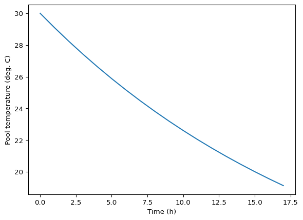
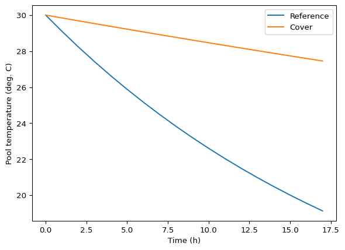
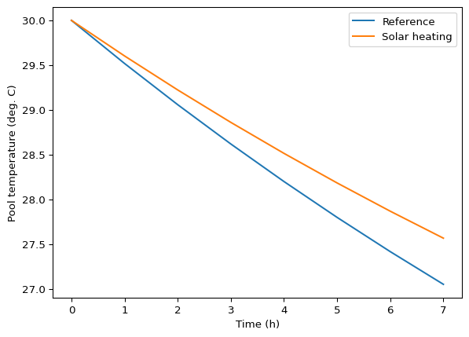

# Application of swimming pool heat models
Modeling 2025 instructures

# 1. Overview

This document is meant to both apply and explain the pool cooling models
defined in the `pool_mods.py` module. This mix of text and code is
written in a “Quarto Markdown” file with a `.qmd` extension. That is
just done to make it easy to mix text, Python code and output, and
figures. All the Python code here could be put in a regular `.py` script
and run line by line or all at one time. This document is not meant to
be an example report, but much of the content would have been suitable
for inclusion in a report.

# 2. Python prep

Import packages.

``` python
import numpy as np
import matplotlib.pyplot as plt
from importlib import reload
```

Import and name the user-defined module that has our cooling models. Be
sure to take a look at this file `pool_mods.py`!

``` python
import pool_mods as pm
```

For development of the model functions, use `reload()` every time the
pool_mods.py module is edited. You would not typically include this in a
final script that is meant to be shared with others, but you should use
it and it is fine to keep it in your submitted scripts in this class.

``` python
reload(pm)
```

    <module 'pool_mods' from '/home/sasha/GitHub_repos/course-modelling-2025-private/mini-projects/01_lumped_par_mods/solutions/pool/python/pool_mods.py'>

# 3. Constants

Set areas (all $\text{m}^2$). Assume pool is 10 x 4 x 2 m.

``` python
length = 10
width = 4
depth = 2
a_top = length * width
a_wall = 2 * (length + width) * depth + a_top
```

Other parameters will be set in or just before the model function calls.

# 4. Initial model exploration

First, let’s look at a steady-state solution for a bad scenario with
cool air in the night. We’ll assume air and the substrate both have a
temperature of 10 degrees C. In this case we should be able to predict
that the steady-state pool temperature will be the same, 10 degrees. In
fact this system would be at thermal *equilibrium* in contrast to
steady-state.

``` python
pm.ssmod(a_top = a_top,
         a_wall = a_wall,
         depth = depth,
         q_sol = 0,
         u_top = 100,
         u_wall = 3,
         temp_air = 10,
         temp_sub = 10,
         flow_renew = 0,
         temp_renew = 0)
```

    10.0

So that result is not a surprise. We might see what we would get with
different substrate and air temperatures. But really, understanding this
pool cooling problem will require the dynamic model. How quickly it
cools off is more important than a steady-state temperature that is
never reached.

Here is the pool cooling over a 17 hour night, starting at 30 degrees.
Of course it is a simplification to have constant air temperature, but
we can approximate the response, and we could use the minimum and
maximum night temperature to bracket the true response.

``` python
pred1 = pm.dynmod(a_top = a_top,
                  a_wall = a_wall,
                  depth = depth,
                  q_sol = 0,
                  u_top = 100,
                  u_wall = 3,
                  temp_air = 10,
                  temp_sub = 10,
                  flow_renew = 0,
                  temp_renew = 0,
              temp_init = 30,
              t_range = (0, 3600 * 17),
              t_step = 3600)
```

Plot results.

``` python
plt.plot(pred1.t / 3600, pred1.y[0, :])
plt.xlabel('Time (h)')
plt.ylabel('Pool temperature (deg. C)')
plt.show()
```



The model predicts that water temperature would get close to 20 degrees
overnight.

What if substrate was a bit warmer, and warmer than the air? This is
common in the fall. First, steady-state.

``` python
pm.ssmod(a_top = a_top,
         a_wall = a_wall,
         depth = depth,
         q_sol = 0,
         u_top = 100,
         u_wall = 3,
         temp_air = 10,
         temp_sub = 15,
         flow_renew = 0,
         temp_renew = 0)
```

    10.335820895522389

The substrate effect is quite small, which is not surprising considering
the difference in the overall heat transfer coefficients. This, and the
difference between the heat transfer coefficients, also tells us that
insulating the sides and bottom would not have much of an effect.

Does solar radiation (insolation) have much of an effect? We’ll assume
an average 200 W/m2, which is my guess for a typical spring or fall day,
remembering that it applies only to daylight hours.

``` python
pm.ssmod(a_top = a_top,
         a_wall = a_wall,
         depth = depth,
         q_sol = 200,
         u_top = 100,
         u_wall = 3,
         temp_air = 10,
         temp_sub = 15,
         flow_renew = 0,
         temp_renew = 0)
```

    12.201492537313433

Just a degree. Solar radiation will not have a major effect.

# 5. Reference scenario

Now we’ll focus on the dynamic model function and apply it more
systematically for a reference scenario and some others. For the model
application let’s focus on the pool cooling off during a typical and
unusually cold night. Back to our 17 hour 10 degree night for the
reference scenario.

``` python
pred_ref = pm.dynmod(a_top = a_top,
                  a_wall = a_wall,
                  depth = depth,
                  q_sol = 0,
                  u_top = 100,
                  u_wall = 3,
                  temp_air = 10,
                  temp_sub = 10,
                  flow_renew = 0,
                  temp_renew = 0,
              temp_init = 30,
              t_range = (0, 3600 * 17),
              t_step = 3600)
```

``` python
pred_ref.y
```

    array([[30.        , 29.09773198, 28.23616851, 27.41347334, 26.62781965,
            25.87745805, 25.16088785, 24.47665687, 23.82335695, 23.19962394,
            22.60413769, 22.03562204, 21.49284488, 20.97461806, 20.47979745,
            20.00728295, 19.55601843, 19.12499179]])

``` python
plt.plot(pred_ref.t / 3600, pred_ref.y[0, :])
plt.xlabel('Time (h)')
plt.ylabel('Pool temperature (deg. C)')
plt.show()
```


# 6. Covering the pool

Let’s add a floating plastic cover with air cells. We’ll try to estimate
$h$ from theory. It if is 10 mm thick and has completely stagnant air
inside, we can use $k/L$ for our estimate and combine it with the
reference heat transfer coefficient using the series equation. Thermal
conductivity of air is around 0.03 W/m-K.

``` python
0.03 / 0.01
u_top = 1 / (1/100 + 0.01/0.03)
u_top
```

    2.9126213592233006

Even before running the model we can see that is a major reduction in
heat transfer. Is it realistic? Almost certainly not. First, air is not
going to be stagnant because of buoyancy-driven convection. And no cover
covers perfectly. And we must have some conduction through the plastic
“walls” of each air cell. So let’s set it to 20 W/m-K instead. Like all
parameter values in this analysis, that is a guess!

``` python
u_top = 20
```

``` python
pred_cvr = pm.dynmod(a_top = a_top,
                    a_wall = a_wall,
                    depth = depth,
                    q_sol = 0,
                    u_top = 9,
                    u_wall = 3,
                    temp_air = 5,
                    temp_sub = 10,
                    flow_renew = 0,
                    temp_renew = 0,
                temp_init = 30,
                t_range = (0, 3600 * 17),
                t_step = 3600)
```

``` python
pred_cvr.y
```

    array([[30.        , 29.84165344, 29.68440767, 29.52825505, 29.37318796,
            29.21919887, 29.06628028, 28.91442474, 28.76362487, 28.61387334,
            28.46516285, 28.31748618, 28.17083612, 28.02520555, 27.88058738,
            27.73697456, 27.5943601 , 27.45273707]])

``` python
plt.plot(pred_ref.t / 3600, pred_ref.y[0, :], label = 'Reference')
plt.plot(pred_cvr.t / 3600, pred_cvr.y[0, :], label = 'Cover')
plt.legend()
plt.xlabel('Time (h)')
plt.ylabel('Pool temperature (deg. C)')
plt.show()
```



There is a drastic improvement.

# 7. More solar energy

This scenario just applies to daytime. First we’ll need a reference
scenario for the day.

``` python
pred_day_ref = pm.dynmod(a_top = a_top,
                  a_wall = a_wall,
                  depth = depth,
                  q_sol = 200,
                  u_top = 100,
                  u_wall = 3,
                  temp_air = 18,
                  temp_sub = 10,
                  flow_renew = 0,
                  temp_renew = 0,
              temp_init = 30,
              t_range = (0, 3600 * 7),
              t_step = 3600)
```

Check the final value (we will plot it later).

``` python
pred_day_ref.y[0, -1]
```

    np.float64(27.053275968189528)

The model function uses the upper water area for calculating both
convection heat loss and solar heating. We could change that by adding a
new parameter. But a “quick and dirty” approach is to multiply the solar
radiation heat flux by a fixed factor. Let’s say we’ll double the solar
area.

``` python
pred_day_sol = pm.dynmod(a_top = a_top,
                  a_wall = a_wall,
                  depth = depth,
                  q_sol = 2 * 200,
                  u_top = 100,
                  u_wall = 3,
                  temp_air = 18,
                  temp_sub = 10,
                  flow_renew = 0,
                  temp_renew = 0,
              temp_init = 30,
              t_range = (0, 3600 * 7),
              t_step = 3600)
```

``` python
pred_day_sol.y[0, -1]
```

    np.float64(27.568437511370963)

That looks like a minor effect. Let’s plot them.

``` python
plt.plot(pred_day_ref.t / 3600, pred_day_ref.y[0, :], label = 'Reference')
plt.plot(pred_day_sol.t / 3600, pred_day_sol.y[0, :], label = 'Solar heating')
plt.legend()
plt.xlabel('Time (h)')
plt.ylabel('Pool temperature (deg. C)')
plt.show()
```


