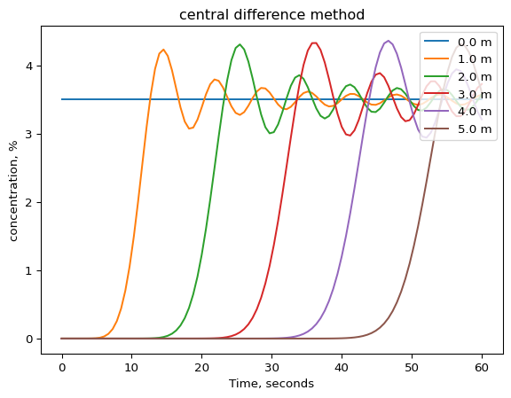
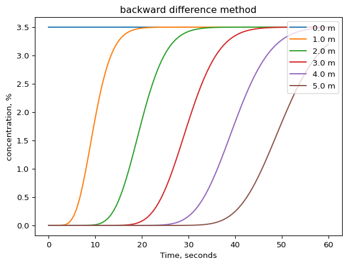
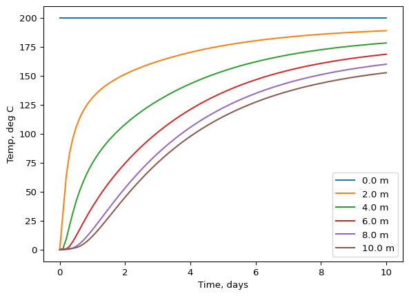
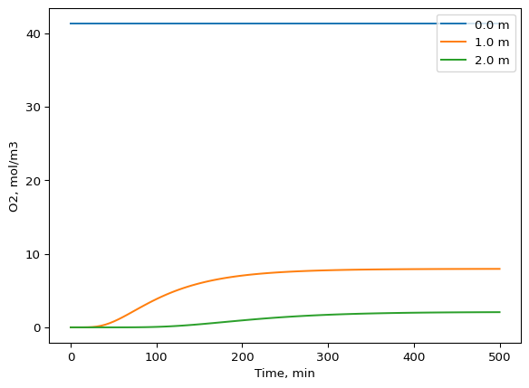
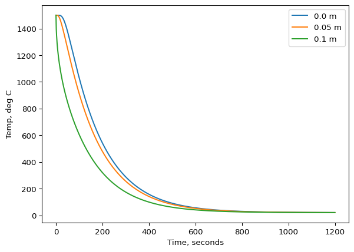
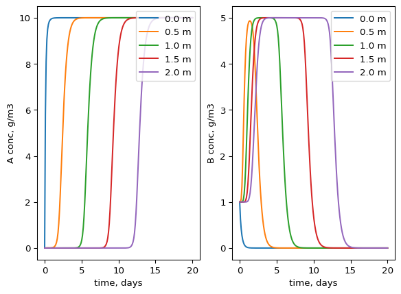

1.  Identify from the problem text where information is given about the
    boundary conditions and initial conditions. What type of BCs are
    given? Try to formulate the BCs and ICs for each problem (if any are
    given.

A\) Oxygen diffuses into your cell tissure at your forehead while your
cycling. The wind is blowing and constantly refreshing the air at the
surface of your forehead. By sticking a micro oxygen sensor into your
cell tissue on your forehead you notice that the concentration of oxygen
drops and then increases again until you hit a capillary arteria, which
is saturated with oxygen.

Solution: Since the wind is constantly refreshing the air at the surface
we can interpret this as a constant concentration of oxygen (atmospheric
pressure – 21% oxygen). Similarly at the capillary we have a flow of
blood with saturated oxygen which is constant at that concentration.
Therefore we have Dirichlet boundary conditions at the cell surface and
at the capillary (fixed state variables -oxygen concentration).
`C(x=0,t) = C_air, C(x=L,t) = C_capillay`. The problem does not say much
about the starting conditions of oxygen in the cell, but if we want some
dynamic behaviour it would make sense to set initial oxygen oxygen
concentration to 0 at all interior points, except at the boundaries.
This can be written as `C(x, t=0) = f(x)`, where `f(x)` is a function
that produce a vector like `(C_air, 0, …, 0, C_capillay)`. Over time the
interior points will increase in oxygen concentration to some steady
state values.

B\) You are designing a drug delivery system where a biodegradable
polymer implant releases medication into surrounding tissue. The implant
is embedded inside a muscle, and the drug diffuses outward through the
muscle tissue. At the surface of the implant, the drug is released at a
constant rate controlled by the degradation of the polymer. Far away
from the implant, at a certain distance, the tissue type changes and the
drug cannot cross that barrier.

Solution: We are told that the drug is released at a constant rate –
rate is change over time (the derivative or flux). So here we have a
Neumann condition. In the other end the drug cannot pass, so there a
flux of 0. That is also a Neumann condition.
`dC/dx(x = surface, t) = C_flux_surface, dC/dx(x = barrier, t) = 0`. It
seems the drug is inserted into the body and at that time we can assume
that there is no drug present. The initial condition would therefore be
`C(x, t=0) = 0`.

C\) You have a long metal rod heated at one end by an electric heater
that maintains the rod tip at a constant temperature. The other end of
the rod is insulated so that no heat can escape from that side. Over
time, heat diffuses through the rod, and you want to analyse the
temperature distribution inside the rod.

Solution: The rod tip is maintained at a constant temperature (fixed
state variable) and in the other end it is insulated, so there is no
flux. This is a dirichlet BC at the tip and a Neumann BC in the
insulated end of the rod.
`C(x = tip, t) = T_tip, dC/dx(x = insulated_end, t) = 0`. We can
e.g. assume that the rod starts at a temperature of 0 or at the constant
temperature at the tip. We need more information about what we want to
model in this problem in order to determine the initial condition.

D\) A hot metal sphere is suddenly immersed in a large water bath
maintained at a constant temperature. The sphere cools down by losing
heat through its surface by convection to the surround water. The
temperature inside the sphere changes with time as heat diffuses
radially from the center to the surface, and the heat flux at the
surface depends on the difference between the sphere’s surface
temperature and the water temperature.

Solution: It seems we are interested in modelling the heat loss from the
sphere to the water bath and how it cools over time. The heat flux from
the sphere to the water depends on a temperature difference. Here we
have that heat flux, `k\* dT/dx`, depends on the state variable itself.
So `-k*dT/dx = f(T(x = surface, t))`. This is a robin BC. This situation
often encountered and it is common to assume that the function is heat
convection (heat removal due to diffusion and moving the fluid in the
water bath). From the problem we get the impression that the water bath
has a single fixed temperature, therefore it most be well mixed and heat
should be removed from the sphere by convection. We can assume that heat
convection at the surface and therefore also the flux of heat from the
surface is `h*(T_surface – T_waterbath)`. So
`-k*dT/dx = h*(T(x=surface, t) – T_waterbath)` At the center of the
sphere heat is only flowing away and towards the surface of the sphere.
This is equivalent to a flux of 0 at the center of the sphere, which is
symmetrical. Therefore, we have a Neumann condition at the center of the
sphere. Actually, because we have a sphere we should not use x anymore,
but rather r, which denotes the distance from the center of the
symmetric sphere outwards to the surface.
`-k*dT/dr = h*(T(r=R, t) – T_waterbath) -k\*dT/dr(r = 0, t) = 0`. The
initial temperature of the sphere is probably way above the water bath
temperature and probably uniformly distributed on the sphere. So
`T(t=0, r) = T_start_sphere`.

2.  Try to set up this mathematical model in python
    $$\frac{\partial C_A}{\partial t} = -v \frac{\partial C_A}{\partial x}$$

How many boundary conditions and initial conditions do you need? Use a
Dirichlet BC and solve it with method of lines in python. For
discretization of the first derivative try: central difference and
backward difference, which is better?

We need 1 IC for dCA/dt and 1 BC for dCA/dx. For central difference
first:

``` python
    import numpy as np
    from scipy.integrate import solve_ivp
    import matplotlib.pyplot as plt

    # Lets say we model flow of saltwater

    v = 0.1 # m/s, some velocity
    dx = 0.1 # 0.1, m step size
    x = np.arange(0, 5 + dx, dx)  # pipe is 5 meter long
    tmax = 60 # 1 minute in seconds

    # Initial conditions: 3.5% saltwater entering, rest is just deionized water
    c0 = np.zeros(len(x))
    c0[0] = 3.5 # %

    def dcdt(t, c, v, dx, x):
        
        dcdt = np.zeros(len(x)) # zero array for holding derivatives
        
        # since there is always 3.5% at the left end (dirichlet) 
        # there is no change over time at x = 0! 
        # we just have to specify that the initial concentration at x = 0 does not
        # change with time:
        dcdt[0] = 0
       
        #interior points with central difference:
        for i in range(1, len(x)-1):
                dcdt[i] = -v * (c[i+1] - c[i-1])/(2*dx)    
        
        # For the last point we need to use backward difference instead, 
        # because we cannot use the ghost point method here. 
        # What happens if you try anyway? 
        dcdt[-1] = -v * (c[-1] - c[-2])/dx
        
        # try ghost point: We either have to force what the concentration is on the other side. But that is not allowed
        # because the flow of information comes from the left to right in a pure advection problem
        # alternatively we must assume that there is some flux. But ficks law is only for diffusion and that does not apply here.
        # lets try anyway to say that the flux is 0. 
        # J = -D * dcdx = 0 -> dcdx = 0 -> c[N+1] = c[N-1]. We now make a mistake and substitute into the advection term. 
        # dcdt[-1] = -v * (c[-2] - c[-2])/(2*dx) # this gives a zero flux at the end
        # If we do this we will see that the concentration drops when we reach the end and after some time.
        # this should not be possible. 
        
        return dcdt

    sol = solve_ivp(dcdt, [0, tmax], c0, method='BDF', 
                    t_eval=np.linspace(0, tmax, 100), args=(v, dx, x))

    plt.ioff()
    for i in range(0, len(x), 10):
        plt.plot(sol.t, sol.y[i], label = f'{i*dx} m')

    plt.legend(loc = 1)
    plt.title('central difference method')
    plt.xlabel('Time, seconds')
    plt.ylabel('concentration, %')
    plt.show()
```



For backward difference:

``` python
    import numpy as np
    from scipy.integrate import solve_ivp
    import matplotlib.pyplot as plt

    # Lets say we model flow of saltwater

    v = 0.1 # m/s, some velocity
    dx = 0.1 # 0.1, m step size
    x = np.arange(0, 5 + dx, dx)  # pipe is 5 meter long
    tmax = 60 # 1 minute in seconds

    # Initial conditions: 3.5% saltwater entering, rest is just deionized water
    c0 = np.zeros(len(x))
    c0[0] = 3.5 # %

    def dcdt(t, c, v, dx, x):
        
        dcdt = np.zeros(len(x)) # zero array for holding derivatives
        
        # since there is always 3.5% at the left end (dirichlet) 
        # there is no change over time at x = 0! 
        # we just have to specify that the initial concentration at x = 0 does not
        # change with time:
        dcdt[0] = 0
       
        #interior points with backward difference including right boundary point:
        
        for i in range(1, len(x)):
                dcdt[i] = -v * (c[i] - c[i-1])/dx      
        return dcdt


    sol = solve_ivp(dcdt, [0, tmax], c0, method='BDF', 
                    t_eval=np.linspace(0, tmax, 100), args=(v, dx, x))

    plt.ioff()
    for i in range(0, len(x), 10):
        plt.plot(sol.t, sol.y[i], label = f'{i*dx} m')

    plt.legend(loc = 1)
    plt.title('backward difference method')
    plt.xlabel('Time, seconds')
    plt.ylabel('concentration, %')
    plt.show()
```



It seems that using central difference gives an unstable solution :( We
need to keep this in mind in the future for when we discretize advection
terms!

3.  Construct a model that predicts the temperature along a 10 m long
    insulated copper wire. In one end of the wire a heat source provides
    enough energy to ensure that the temperature is 200 degree C, the
    other end is open to the surrounding air.

``` python
import numpy as np
from scipy.integrate import solve_ivp
import matplotlib.pyplot as plt

# finding constants from the internet about copper 
cp = 385 # J/(kg * K)
k = 401 # W/(m*K)
p = 8960 # kg/m3
a = k/(cp*p) # m2/s
T_air = 20 # degree C
h = 10 # W/(K * m2)

# grid
L = 10 # length of wire, m
dx = 0.1 # distance between nodes, m
x = np.arange(0, 10 + dx, dx) # grid 
tmax = 60*60*24*10 # lets try to run for 10 days in seconds 
# (since we don't know any better for now)

# initial conditions:
T0 = np.zeros(len(x))
T0[0] = 200 # deg C

# Defining the rates function or dT/dt function

def dTdt(t, T, dx, a, h, p, cp, T_air):
    
    dTdt = np.zeros(len(x))
    N = len(x) - 1
    
    # The temperature is fixed at 200 in one end so it is a 
    # Dirichlet boundary condition: no change from the initial condition
    # therefore set dT/dt to 0 at index 0
    dTdt[0] = 0 # K/s
    
    # robin condition at the right side because it is open to the air
    # so we can assume that the heat is transfered to outside by convection
    # the flux is therefore balanced by heat convection equation at index N
    # q = -k*dT/dx = h * T[N] - T_air
    # q = -k * (T[N+1]- T[N-1])/(2*dx) = h * (T_air - T[N])
    # isolate T[N+1]: 
    # T[N+1] = T[N-1] - 2dx*h/k * (T_air - T[N])
    # write ghost point variable here: 
    TN1 = T[N-1] - 2*dx*h/k * (T[N] - T_air)
    
    # now we must put TN1 into the second order approximation of d2Tdx2

    dTdt[N] = a * (TN1 - 2*T[N] + T[N-1])/dx**2 # K/s
    
    # and now loop through the interior points using central difference for 
    # diffusion terms
    for i in range(1, N):
        dTdt[i] = a * (T[i+1] - 2*T[i] + T[i-1])/dx**2
        
    return dTdt

sol = solve_ivp(dTdt, [0, tmax], T0, method = 'BDF', t_eval = np.linspace(0, tmax, 100), args=(dx, a, h, p, cp, T_air))

plt.ioff()

# plotting different positions and their temp development over time
for i in range(0, len(x), 20):
    plt.plot(sol.t/(60*60*24), sol.y[i], label = f'{i*dx} m')

plt.legend(loc = 4)
plt.xlabel('Time, days')
plt.ylabel('Temp, deg C')
plt.show()
```



4.  A 2 m long plug flow reactor converts 100% O2 gas into CO2 gas by
    providing some carbon source inside the reactor. The reaction rate
    follows first order kinetics with k = 0.01 minute-1. Construct a
    model that predicts the concentration of O2 along the plug flow
    reactor. Choose reasonable values for your model variables and use
    it to estimate approximately the minimum flow rate needed to reach
    O2 concentration in the outlet of 5% at a steady state. How long
    time does the reactor need to run before a steady-state is reached?

``` python
import numpy as np
from scipy.integrate import solve_ivp
import matplotlib.pyplot as plt

L = 2 # m long reactor
dx = 0.1 # space between nodes
x = np.arange(0, L+dx,dx)
tmax = 500 # minutes, to try something
k = 0.01 # 1/min
D = 2*10**(-5)*60 # m2/min, from internet
v = 0.003759 # m/min, pick some velocity and tune up or down
c0 = np.zeros(len(x)) # initial condition vector
c0[0] = 41.3 # moles/m3. This number estimated from the 

# ideal gas law at 1 atm and 20 deg C
# n = P*V/(R*T) = 1 atm * 1000 L/(0.08257 L atm/(mol K) * 293 K) = 41.3 moles/m3

c_outlet_aim = 0.05 * 41.3 # this is what we aim for at the reactor end

# making the dcdt function
def dcdt(t, c, k, D, v, dx):
    
    dcdt = np.zeros(len(c))
    N = len(c)-1
    
    # constant concentration at inlet, because we feed with a constant flow
    # of pure oxygen. We fix that by setting dcdt at the left side to 0.
    dcdt[0] = 0
    
    # at right side we actually have dcdx = 0! why is that? 
    # because if the PFR is open in the right end and we don't know what goes 
    # on outside the reactor, we might as well assume that nothing happens
    # this means that the concentration does not change with x outside 
    # the reactor, which is the same as dcdx[N] = 0. We can implement this using 
    # a ghost point and realising that c[N+1] = c[N-1]. Then substituting into 
    # diffusion term. Reaction is added as first order. 
    
    # notice also that we use backward difference for the advection term
    # to get stable solution
    dcdt[N] = -v*(c[N] - c[N-1])/dx + D * (c[N-1] -2*c[N] + c[N-1])/dx**2 - k * c[N]
    
    # interior loop
    for i in range(1, N):
        dcdt[i] = -v*(c[i] - c[i-1])/dx + D * (c[i-1] -2*c[i] + c[i+1])/dx**2 - k * c[i]
    
    
    return dcdt

sol = solve_ivp(dcdt, [0, tmax], c0, method = 'BDF', t_eval = np.linspace(0, tmax, 100), 
                args = (k, D, v, dx))

plt.ioff()

for i in range(0, len(x), 10):
    plt.plot(sol.t, sol.y[i], label = f'{i*dx} m')

plt.legend(loc = 1)
plt.xlabel('Time, min')
plt.ylabel('O2, mol/m3')
plt.show()

f'The concentration at the end PFR is around {sol.y[-1][-1]} % at a flow velocity of {v}'
# The steady state is reached around 300 min after startup 

# Instead of guessing on v (velocity), we could also have solve it with fsolve()
# Lets try that. 

from scipy.optimize import fsolve

def residual(v_guess):
    """Run the reactor for a given v and return difference from target outlet."""
    sol = solve_ivp(
        dcdt, [0, tmax], c0, method='BDF',
        t_eval=[tmax], args=(k, D, v_guess, dx)
    )
    c_outlet = sol.y[-1, -1]  # outlet concentration at final time
    return c_outlet - c_outlet_aim

init_v_guess = 0.01

solution = fsolve(residual, init_v_guess)

f'The velocity needs to be {solution} m/min in order to achieve a concentration of 5% of the inlet concentration'
```



    C:\Users\au277187\AppData\Local\Temp\ipykernel_15352\3912035505.py:40: DeprecationWarning: Conversion of an array with ndim > 0 to a scalar is deprecated, and will error in future. Ensure you extract a single element from your array before performing this operation. (Deprecated NumPy 1.25.)
      dcdt[N] = -v*(c[N] - c[N-1])/dx + D * (c[N-1] -2*c[N] + c[N-1])/dx**2 - k * c[N]
    C:\Users\au277187\AppData\Local\Temp\ipykernel_15352\3912035505.py:44: DeprecationWarning: Conversion of an array with ndim > 0 to a scalar is deprecated, and will error in future. Ensure you extract a single element from your array before performing this operation. (Deprecated NumPy 1.25.)
      dcdt[i] = -v*(c[i] - c[i-1])/dx + D * (c[i-1] -2*c[i] + c[i+1])/dx**2 - k * c[i]

    'The velocity needs to be [0.00375978] m/min in order to achieve a concentration of 5% of the inlet concentration'

5.  A sphere of iron has to be cooled in a water bath. Construct and
    solve a model in python to predict the temperature of the sphere.
    Consider first what coordinates you want to use and what assumption
    you can make about symmetry. Define your own initial and boundary
    conditions from what you think is realistic and clearly state your
    assumptions. The model should be able to predict the temperature of
    the sphere over time and space.

``` python
import numpy as np
from scipy.integrate import solve_ivp
import matplotlib.pyplot as plt

# the obvious choice would be spherical coordinates now that we have a sphere
# being cooled. 
R = 0.1 # m, some radius of the sphere. 
dr = 0.005 # m
r = np.arange(0, R + dr, dr)
tmax = 60 * 20 # seconds (20 min)

# constants of iron from the internet: 
k = 80
p = 7870
cp = 449

# the heat diffusion is estimated as
a = k/(cp*p)
# heat convection coefficient is a first guess.
h = 1000
# water bath temperature (room temp)
T_water = 20
T0 = np.zeros(len(r))
# the starting temperature of the sphere in all interior points 
T0[:] = 1500

def dTdt(t, T, k, p, cp, a, T_water, r, dr, h):
    
    dTdt = np.zeros(len(T))
    N = len(T)-1
    
    # symmetry at center of sphere, means we can set the flux to 0 at r = 0
    # in spherical coordinates then r = 0, is the center of the sphere. 
    # dTdr = 0, meaning that ghost point (T[start-1]) must be equal to T[1]
    # therefore at center of sphere apply boundary condition for diffusion term
    
    dTdt[0] = a * (T[1] - 2*T[0] + T[1])/dr**2 # the last part (2/r * dTdr) is eliminated because dTdr = 0 at the boundary
    
    
    # at the right side (surface of the sphere) we have a Robin boundary condition
    # we use a ghost point at N+1 and isolate it. 
    
    TGhost1 = T[N-1] - h*2*dr/k*(T[N]-T_water)
    # using that in the diffusion term for spherical coordinates. 
    dTdt[N] = a * (TGhost1 - 2*T[N] + T[N-1])/dr**2 + 2*a/r[N] * (TGhost1 - T[N-1])/(2*dr)
    
    # at interior points
    for i in range(1, N):
        dTdt[i] = a * (T[i+1] - 2*T[i] + T[i-1])/dr**2 + 2*a/r[i] * (T[i+1] - T[i-1])/(2*dr) # use product rule of differentiation to get this GE
    
    return dTdt
    


sol = solve_ivp(dTdt, [0, tmax], T0, method = 'LSODA', t_eval = np.linspace(0, tmax, 1000), 
                args = (k, p, cp, a, T_water, r, dr, h))


plt.ioff()
for i in range(0, len(r), 10):
    plt.plot(sol.t, sol.y[i], label = f'{i*dr} m')

plt.legend(loc = 1)
plt.xlabel('Time, seconds')
plt.ylabel('Temp, deg C')
plt.show()
```



6.  Last exercise is a bit difficult: You want to transfer an aqueous
    solution of acetate with a concentration of 10 g/m3 to a reactor.
    Before the reactor the solution has to go through a 2 m long pipe
    that is already filled with water contaminated with 1 g bacteria/m3.
    You need a flow velocity of 1 m/d in the pipe and you are concerned
    whether the bacteria will eat all the acetate before it reaches the
    reactor. Construct a model that predicts concentrations of acetate
    and bacteria along the pipe and over time. The bacteria follows
    Monod kinetics with a umax of 0.5 pr hour and a half saturation
    constant (Ks) of 0.2 g acetate/m3. The biomass yield of the
    bacteria (Y) is 0.5 g biomass pr g acetate consumed.

``` python
import numpy as np 
import matplotlib.pyplot as plt
from scipy.integrate import solve_ivp

L = 2 # meter
dx = 0.1
x_grid = np.arange(0, L + dx, dx)
v = 1 # m/d

n = len(x_grid)

# A is acetate, B is bacteria biomass
A0 = np.zeros(n)
B0 = np.zeros(n)

# there is 1 g bacteria/m3 for all positions to start with.
B0[:] = 1

c_in_A = 10 # concentration in the inlet streams
c_in_B = 0

# we need to pass initial conditions as 1D array: use np.concatenate
y0 = np.concatenate([A0, B0])

def rates(t, y, D, v, x_grid, dx, umax, Ks, Y, c_in_A, c_in_B):
    
    # make a derivative array for each compound
    n = len(x_grid) 
    
    dAdt = np.zeros(n) # A for acetate
    dBdt = np.zeros(n) # B for bacteria
       
    # extract each state variable to make it easier below.
    A = y[:n]
    B = y[n:]

    # monod kinetics says that the growth rate for bacteria is 
    # u = (umax * substrate)/(substrate + Ks)     
    # change in bacteria = u * bacteria * biomass yield. translating to our
    # state variables the reaction rates becomes:
    # 
    # rA =  -(umax * A[i])/(A[i] + Ks) * B[i] 
    # rB =  (umax * A[i])/(A[i] + Ks) * B[i] * Y
    
    # The pipe is open in the right side, but nothing happens after the pipe (just goes into a reactor and we don't care about that)
    # This is also the same as a dcdx = 0 (Neumann boundary condition).
    # for advection we use backward difference (upwind scheme in this case)
    # for diffusion we use central difference, but substitute ghost point.
    
    dAdt[-1] = -v*(A[-1]-A[-2])/dx + D * (A[-2] - 2*A[-1] + A[-2])/(dx**2) - (umax * A[-1])/(A[-1] + Ks) * B[-1]
    dBdt[-1] = -v*(B[-1]-B[-2])/dx + D * (B[-2] - 2*B[-1] + B[-2])/(dx**2) + (umax * A[-1])/(A[-1] + Ks) * B[-1] * Y
    
    # At the inlet we use backward difference for advection, but then we need 
    # to define the ghost point to the left of the boundary, which is the inlet concentration
    # we pass the inlet concentration of A and B as a constant to the rates function and substitute into the advection and diffusion terms. 
    
    dAdt[0] = -v*(A[0] - c_in_A)/dx + D * (c_in_A - 2*A[0] + A[1])/(dx**2) - (umax * A[0])/(A[0] + Ks) * B[0]
    dBdt[0] = -v*(B[0] - c_in_B)/dx + D * (c_in_B - 2*B[0] + B[1])/(dx**2) + (umax * A[0])/(A[0] + Ks) * B[0] * Y  
      
    # interior points, backward difference for advection, central difference for diffusion.
    for i in range(1, n-1):
        rA = (umax * A[i])/(A[i] + Ks) * B[i]
        rB = (umax * A[i])/(A[i] + Ks) * B[i] * Y 
        dAdt[i] = -v*(A[i]-A[i-1])/dx + D * (A[i+1] - 2*A[i] + A[i-1])/(dx**2) - rA
        dBdt[i] = -v*(B[i]-B[i-1])/dx + D * (B[i+1] - 2*B[i] + B[i-1])/(dx**2) + rB  
    
    # we need to return a 1D array. Which is possible with np.concatenate
    return np.concatenate([dAdt, dBdt])
    
tmax =20 # days
D = 10**(-9) * 3600*24 # m2/d
Y = 0.5 # g/g
Ks = 0.2 # g/m3
umax = 0.5 * 24 # 1/d

# I use BDF method because it is good for stiff problems, and the numbers above
# (umax vs diffusion vs velocity indicate very different rates of change), and the problem might be quite stiff.
sol = solve_ivp(rates, t_span = [0, tmax], y0 = y0, method = "BDF", 
                t_eval = np.linspace(0, tmax, 200), args = (D, v, x_grid, dx, umax, Ks, Y, c_in_A, c_in_B))    

# extracting acetate and bacteria from the solution first
A = sol.y[:n,:]
B = sol.y[n:,:]
# plotting development over time at different positions
plt.subplot(1,2,1)
for i in range(0, n, 5):
    plt.plot(sol.t, A[i,:], label = f'{i*dx} m')
    plt.xlabel('time, days')
    plt.ylabel('A conc, g/m3')
    plt.legend(loc = 1)

plt.subplot(1,2,2)
for i in range(0, n, 5):
    plt.plot(sol.t, B[i,:], label = f'{i*dx} m')
    plt.xlabel('time, days')
    plt.ylabel('B conc, g/m3')
    plt.legend(loc = 1)
    
plt.show()
```



It looks like all bacteria are eventually washed out of the pipe and
therefore the acetate will not be consumed after some time. BUT this may
be different at lower flow velocities.
