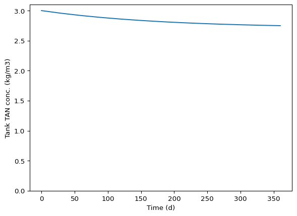
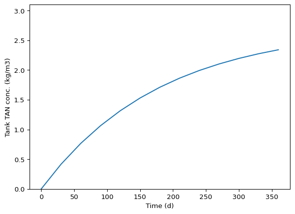
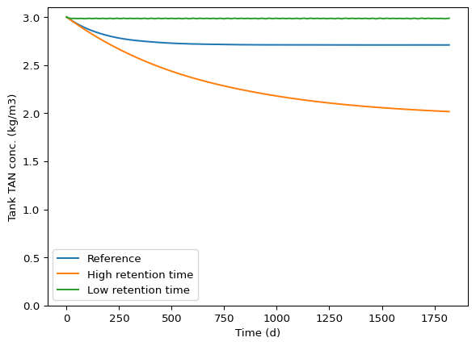
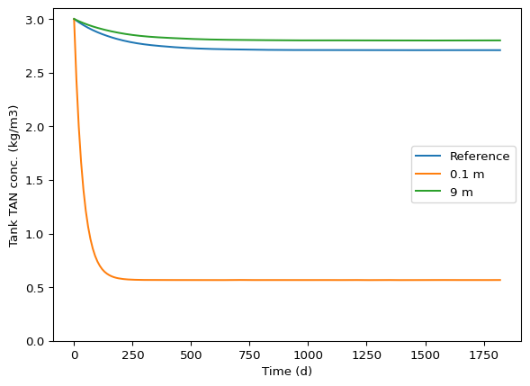
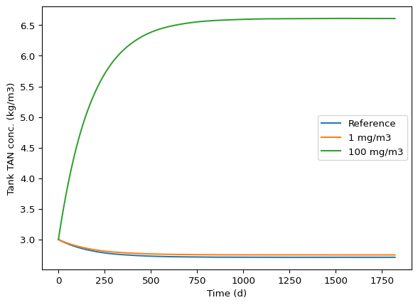
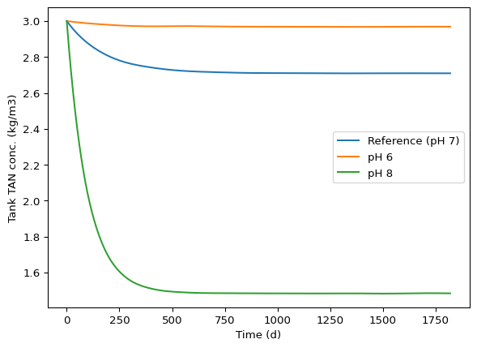
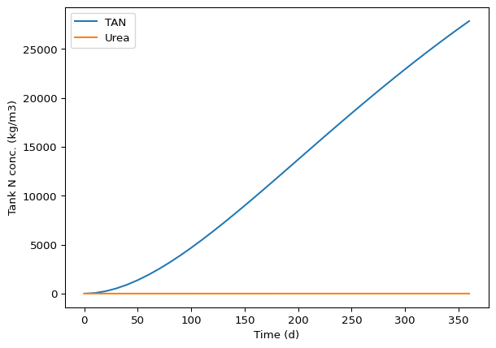
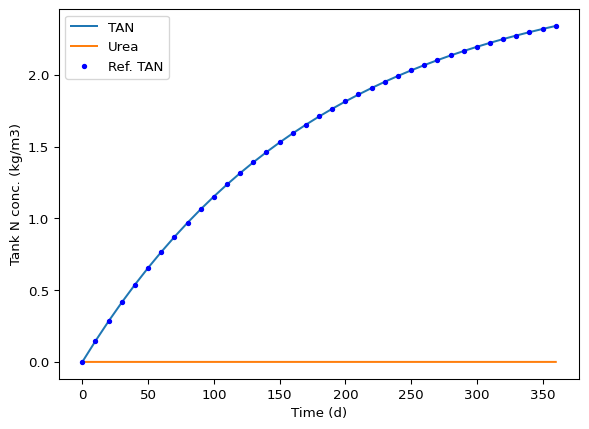
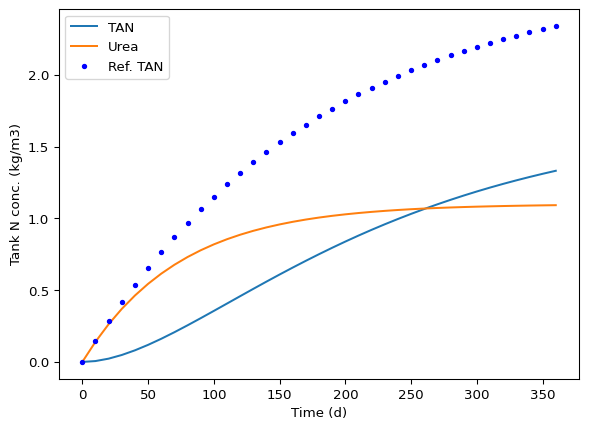

# Ammonia volatilization model verification - solution
Sasha D. Hafner

In this exercise you will work with a version of the ammonia
volatilization model from the first mini-project. This document provides
some details, the `amm_concept_model.pdf` has more, and for even more,
see the solutions to that mini-project. Remember that you need to have a
good understanding of the underlying conceptual and mathematical models
in order to verify a computer model! So make use of those documents.

You’ll use the `dynmod()` function defined in the `amm_mods.py` file in
the same subdirectory as this document. The `amm_mods.py` file is a
*module* that defines the model as a Python function called `dynmod()`.
The script `amm_demo.py` has a short demonstration.

The model simulates total ammonia nitrogen (TAN, the sum of free ammonia
(NH3) and ammonium (NH4+)) in manure in a storage tank. It includes
continuous addition and removal of manure at a fixed rate, so the volume
of manure in the tank does not change. But TAN is lost through
volatilization of ammonia from the surface.

Can you verify the model following the approach we went through in
class? Save your work in a Python script and a text file, or really in
any form that you think is appropriate. If you prefer commenting in the
module file `amm_mods.py` directly, that is fine.

If you struggle to work with the volume-normalized variables and
expressions, you can use the second model function `ddynmod()`, named
for *double* dynamic model because can also simulation tank volume
dynamics. It does not use volume-normalize values, because the volume is
variable over time. In that case you probably want to set the manure
pumping rate (flow) in and out to the same value for simplicity.

For more details on the mass balance and constitutive equations, see
`amm_concept_model.pdf`.

**Solution below** This is quite an extensive model verification below,
and it could still be considered incomplete! We do not expect you to do
this much evaluation in an exercise like this.

# Import packages.

``` python
import numpy as np
import matplotlib.pyplot as plt
from importlib import reload
import amm_mods as am
```

To load new version after edits:

``` python
reload(am)
```

    <module 'amm_mods' from '/home/sasha/GitHub_repos/course-modelling-2025-private/classes/16_23_oct/solutions/ammonia/amm_mods.py'>

# Reference inputs

We’ll use some of these repeatedly.

``` python
rt = 200 * 86400   # s
depth = 4          # m
```

``` python
kl = 0.01 / 2300   # m/s
c_bg = 0.          # kg/m3
pH = 7.            
c_TAN_in = 3       # kg/m3
c_urea_in = 0      # kg/m3
ku = 0.            # 1/s
```

# Reference predictions as demo

Let’s use the inputs we set above to see how much of the TAN coming into
the tank would be lost.

``` python
pred01 =  am.dynmod(rt = rt,
                    depth = depth,
                    c_TAN_in = c_TAN_in,
                    c_urea_in = c_urea_in,
                    c_TAN_0 = c_TAN_in,
                    c_urea_0 = c_urea_in,
                    c_bg = c_bg,
                    pH = pH,
                    ku = ku,
                    kl = kl,
                    times = np.arange(0, 365 * 86400, 30 * 86400)
)
```

What does output look like?

``` python
pred01
```

    {'t': array([       0,  2592000,  5184000,  7776000, 10368000, 12960000,
            15552000, 18144000, 20736000, 23328000, 25920000, 28512000,
            31104000]),
     'tan': array([3.        , 2.95543857, 2.91769115, 2.88573901, 2.85868519,
            2.83569261, 2.81607744, 2.79947751, 2.78553508, 2.77388321,
            2.76414577, 2.75593744, 2.74886371]),
     'urea': array([0., 0., 0., 0., 0., 0., 0., 0., 0., 0., 0., 0., 0.])}

It is a dictionary (you can also see this by looking at the model
function code in the `amm_mods.py` module. To see the change in ammonia
concentration in the tank over time, a plot is probably better.

``` python
plt.close()
plt.plot(pred01['t'] / 86400, pred01['tan'])
plt.ylim(0, 3.1)
plt.xlabel('Time (d)')
plt.ylabel('Tank TAN conc. (kg/m3)')
plt.show()
```



What happens when we start with 0 initial TAN?

``` python
pred01b =  am.dynmod(rt = rt,
                     depth = depth,
                     c_TAN_in = c_TAN_in,
                     c_urea_in = c_urea_in,
                     c_TAN_0 = 0.,
                     c_urea_0 = c_urea_in,
                     c_bg = c_bg,
                     pH = pH,
                     ku = ku,
                     kl = kl,
                     times = np.arange(0, 365 * 86400, 30 * 86400)
)
```

``` python
pred01b
```

    {'t': array([       0,  2592000,  5184000,  7776000, 10368000, 12960000,
            15552000, 18144000, 20736000, 23328000, 25920000, 28512000,
            31104000]),
     'tan': array([0.        , 0.41464752, 0.76585912, 1.06319463, 1.31501396,
            1.52856846, 1.70944267, 1.86236703, 1.99166188, 2.10123752,
            2.19424935, 2.27301594, 2.33972175]),
     'urea': array([0., 0., 0., 0., 0., 0., 0., 0., 0., 0., 0., 0., 0.])}

``` python
plt.close()
plt.plot(pred01b['t'] / 86400, pred01b['tan'])
plt.ylim(0, 3.1)
plt.xlabel('Time (d)')
plt.ylabel('Tank TAN conc. (kg/m3)')
plt.show()
```



So, the model predicts that the TAN concentration in the storage tank
increases or decreases, depending on the starting concentration, and
tends toward a steady-state value, of course below the initial
concentration (at least when we have left out urea, based on the
assumption that all urea is converted to TAN quickly, prior to transfer
to the tank). Thinking about our conceptual model, at steady-state the
volatilization rate must exactly match the difference between TAN flow
in and out of the tank. If we start with the `c_TAN_in` concentration in
the tank, as volatilization removes TAN the rate of volatilization drops
while the difference between TAN coming in and going out increases. So
we have a kind of negative feedback, which is very common in mass
transfer models–here removal of TAN by NH3 volatilization reduces the
rate of volatilization. Now we have some basic understanding of the
conceptual, mathemtical, and computer models. So let’s proceed with
verification.

# Conservation - mass balance - check of code

First, let’s try to check the conservation equation we came up with in
the model formulation. Take a look at the mass balance equation in that
pdf in the exercise directory. It looks like this:

    accumulation = pumped in - volatilize out + generation - pumped out

with all terms as rate of change in concentration, i.e.,
$\text{kg} ~ \text{m}^{-3} ~ \text{s}^{-1}$. Let’s take a look at the
`rates()` function code and look for the closest thing to the
conservation equation. It could be hidden, but it sure makes
verification easier if it looks similar to the conservation equation.
And we’ve written it very clearly on line 110 as the expression that
gives the derivative for our TAN concentration state variable:

            dc_TAN_dt = TAN_in - TAN_out + urea_hyd - volat

Does that look OK? Check for terms and the signs. To me it looks OK,
even though the order is different from in the pdf.

And for urea:

            dc_urea_dt = urea_in - urea_out 

Compare to the pdf version:

    Urea accumulation = urea pumping in - urea hydrolysis - urea pumping out

We are missing urea hydrolysis in the model code! That is a big problem.
Let’s not fix it yet, so we can see how that issue will affect
verification done through model calls.

# Check of code for constitutive equations

Now let’s work backwards and see how the individual terms are
calculated. This will be a check of the constitutive equations. Here are
the expressions for calculating individual terms in the conservation
equation from line 100+:

            TAN_in = c_TAN_in / rt
            TAN_out = c_TAN / rt

            urea_in = c_urea_in / rt
            urea_out = c_urea / rt

            urea_hyd = ku * c_urea

            volat = kl / depth * (frac_NH3 * c_TAN - c_bg * hen)

The `rates()` docstring claims units are kg/m3-s as N. We should check
each term. It can be helpful to enter units in comments. This can go in
a notes file or even right in the source code, i.e., the module here.
Like this:

    #                kg/m3    / s -> kg/m3-s
            TAN_in = c_TAN_in / rt
    #                 kg/m3 / s -> kg/m3-s
            TAN_out = c_TAN / rt

    #                     kg/m3 / s -> kg/m3-s
            urea_in = c_urea_in / rt
    #                   kg/m3 / s -> kg/m3-s
            urea_out = c_urea / rt

    #                  1/s * kg/m3  -> kg/m3-s
            urea_hyd = ku * c_urea

    #              m/s /   m   * (    .      kg/m3 - kg/m3 * . )
    #              m/s /   m   * (kg/m3) ------------------------> kg/m3-s
            volat = kl / depth * (frac_NH3 * c_TAN - c_bg * hen)

    #                  kg/m3-s ...
            dc_TAN_dt = TAN_in - TAN_out + urea_hyd - volat
    #                   kg/m3-s ...
            dc_urea_dt = urea_in - urea_out 

I don’t see any unit problems.

We should also do a conceptual check of these expressions. Do they match
the constitutive equations in the pdf? It is probably a good idea to do
the conceptual check before checking units. Similar to the units check
above, I’ll copy in the code and use comments to document a check.

    # These both look correct
            TAN_in = c_TAN_in / rt
            TAN_out = c_TAN / rt

    # These too
            urea_in = c_urea_in / rt
            urea_out = c_urea / rt

    # Fine
            urea_hyd = ku * c_urea

    # Mostly OK but in the pdf we have / hen not * hen!
    # See text below
            volat = kl / depth * (frac_NH3 * c_TAN - c_bg * hen)

That Henry’s law issue is a thorny one. First, this is interphase mass
transfer, which is just difficult to understand. Second, Henry’s law
constant is anything but constant! Yes, it changes with temperature and
more, and of course varies between different compounds. But I mean even
for the exact same compound and temperature it can be expressed with
different dimensions and units, for use in different ways. So it is just
a hassle to work with. I have use a dimensionless form in the model. And
I wrote in the model function docstring that it is aq:g, which means it
gives the equilibrium ratio of dissolved to gas concentration in the
same volumetric units. Some people prefer to use the inverse of this
form, or a g:aq ratio. And they may just describe it as “dimensionless”,
which accurately describes the form we used as well. See why Henry’s law
constant is so confusing?

Anyway, in our model, the default value of 2300 means the concentration
of the “free ammonia” species NH3 (aq) is 2300 times the equilibrium gas
phase concentration when both are in g/m3 or similar units (mg/L,
mol/m3, mmol/m3, etc., but *not* g/kg or ppm (which means different
things for gas and solutions!)). So although `hen` is dimensionless, we
should hang onto that aq:g tag. Looking at the code,

    ... (frac_NH3 * c_TAN - c_bg * hen)

you should be able to tell that the stuff in `( )` must be aqueous phase
(manure phase, also called “liquid phase” by engineers and sometimes me
too even though that probably would annoy a chemist) concentration(s).
So this bit,

    ... c_bg * hen

has to be aqueous phase, so `c_bg` must be gas phase and `hen` must
convert it to aqueous phase. And indeed an aq:g `hen` will convert a gas
phase concentration to aqueous when multiplied by it (gas phase \* aq
phase / gas phase = aq phase). So the code actually looks correct, and
the pdf looks wrong!

Worse, the information for `c_bg` in the model function docstring seems
wrong!

        c_bg : float
            Converted concentration of NH3 (g) in ambient (background) 
            air (kg/m3 as N in aqueous phase).

Well, if it were in fact already converted to an aqueous phase
concentration then we wouldn’t need `hen` in the model at all. So which
is it? The information above from the docstring is in fact wrong. If
this seems like a unreasonable and terribly confusing mix of errors for
a model verification exercise, please accept my apologies; In fact the
two errors were unintentional and the correct code was meant to be an
error! On the other hand, it is a pretty realistic example for model
verification!

# Verification through model calls

Now for some indirect checks. By carefully thinking about the model we
can develop function calls (particular combinations of model inputs)
that can let us test whether the model behaves the way it should. But we
have to be careful in interpretation–not seeing a problem in a
particular case does not mean there are no problems! In fact
verification generally cannot tell us that there are no problems.

First, let’s check the long-term ammonia concentration that is
established when volatilization is completely blocked. Volatilization
can be stopped by setting `kl` to zero. We will just use TAN for
now–still no urea coming in or being hydrolyzed. We expect that the
long-term concentration is the concentration coming in.

``` python
pred02 =  am.dynmod(rt = rt,
                    depth = depth,
                    c_TAN_in = c_TAN_in,
                    c_urea_in = c_urea_in,
                    c_TAN_0 = c_TAN_in,
                    c_urea_0 = c_urea_in,
                    c_bg = c_bg,
                    pH = pH,
                    ku = ku,
                    kl = 0.,
                    times = [0, 730 * 86400]
) 
```

``` python
pred02['tan']
```

    array([3., 3.])

That looks right. What if we start with another value?

``` python
pred03 =  am.dynmod(rt = rt,
                    depth = depth,
                    c_TAN_in = c_TAN_in,
                    c_urea_in = c_urea_in,
                    c_TAN_0 = 0.,
                    c_urea_0 = c_urea_in,
                    c_bg = c_bg,
                    pH = pH,
                    ku = ku,
                    kl = 0.,
                    times = [0, 730 * 86400]
) 
```

``` python
pred03['tan']
```

    array([0.        , 2.92161454])

Seems the model is heading to 3. Let’s add some longer times.

``` python
pred04 =  am.dynmod(rt = rt,
                    depth = depth,
                    c_TAN_in = c_TAN_in,
                    c_urea_in = c_urea_in,
                    c_TAN_0 = 0.,
                    c_urea_0 = c_urea_in,
                    c_bg = c_bg,
                    pH = pH,
                    ku = ku,
                    kl = 0.,
                    times = [0, 2 * 365 * 86400, 5 * 365 *85400, 10 * 365 * 86400]
) 
```

``` python
pred04['tan']
```

    array([0.        , 2.92148684, 2.9994412 , 2.99817217])

Looks OK, but with a 200 day retention time, it takes a while to get to
steady-state!

How about with very high emission? Does the model predict complete
depletion? We can set the mass transfer coefficient to a high value, but
what is a high value anyway? In [this document]() we wrote “For flow
over a flat surface (”flat plate” in mass transfer terminology) and wind
speeds between 0.5 and 2 m/s, correlations predict an air-side mass
transfer coefficient between 0.001 and 0.01 m/s. These values are for
concentration differences expressed in gas phase units.” These are for
gas phase units, which means the should be multiplied by a gas-phase
concentration difference, while our model is based on a aqueous-phase
(or liquid-phase or manure-phase) concentration difference. So that is
why we need to *divide* any value in gas-phase units by our
dimensionless aq:g Henry’s law constant. And a very large value would be
1 m/s (air-phase concentrations) or 1/2300 m/s (manure-phase
concentrations). ( Confused? Think about a specific scenario, say 2300
g/m3 of TAN in manure and none in air (no background). So the
concentration difference in manure-phase units would be 2300 g/m3
(because we subtract zero). Converted to air-phase using Henry’s law
constant, it would be 1 g/m3, because the concentration of 2300 g/m3
should be divided by 2300. And, thinking about what an aq:g
dimensionless Henry’s law constant actually means, it tells us that at
equilibrium the aqueous phase concentration will be 2300 times the gas
phase concentration. Now, multiplying by the correct mass transfer
coefficient for either the gas- or manure-phase concentrations must
result in the same flux, because it is one specific system we are
describing after all. So, the mass transfer coefficient for manure-phase
concentrations must be 1/2300 times the original. )

``` python
pred05 =  am.dynmod(rt = rt,
                    depth = depth,
                    c_TAN_in = c_TAN_in,
                    c_urea_in = c_urea_in,
                    c_TAN_0 = 3.,
                    c_urea_0 = c_urea_in,
                    c_bg = c_bg,
                    pH = pH,
                    ku = ku,
                    kl = 1. / 2300,
                    times = np.arange(0, 365 * 86400, 30 * 86400)
) 
```

``` python
pred05['tan']
```

    array([3.        , 0.72702419, 0.33646687, 0.26941513, 0.25780243,
           0.25581283, 0.25550388, 0.2554097 , 0.25534553, 0.25540209,
           0.25539923, 0.25536158, 0.25552772])

So far, so good.

# Qualitative responses

Let’s go back to default model inputs and individually change model
parameters. For comparison, let’s use the reference predictions.

``` python
pred01c =  am.dynmod(rt = rt,
                     depth = depth,
                     c_TAN_in = c_TAN_in,
                     c_urea_in = c_urea_in,
                     c_TAN_0 = c_TAN_in,
                     c_urea_0 = c_urea_in,
                     c_bg = c_bg,
                     pH = pH,
                     ku = ku,
                     kl = kl,
                     times = np.arange(0, 5 * 365 * 86400, 10 * 86400)
)
```

## Retention time

A short retention time gives less time for ammonia volatilization and a
long one more. Do we see the expected response?

``` python
rt / 86400
```

    200.0

``` python
pred06 =  am.dynmod(rt = 1000 * 86400,
                    depth = depth,
                    c_TAN_in = c_TAN_in,
                    c_urea_in = c_urea_in,
                    c_TAN_0 = 3.,
                    c_urea_0 = c_urea_in,
                    c_bg = c_bg,
                    pH = pH,
                    ku = ku,
                    kl = kl,
                    times = np.arange(0, 5 * 365 * 86400, 10 * 86400)
) 
```

``` python
pred07 =  am.dynmod(rt = 10 * 86400,
                    depth = depth,
                    c_TAN_in = c_TAN_in,
                    c_urea_in = c_urea_in,
                    c_TAN_0 = 3.,
                    c_urea_0 = c_urea_in,
                    c_bg = c_bg,
                    pH = pH,
                    ku = ku,
                    kl = kl,
                    times = np.arange(0, 5 * 365 * 86400, 10 * 86400)
) 
```

``` python
plt.close()
plt.plot(pred01c['t'] / 86400, pred01c['tan'], label = 'Reference')
plt.plot(pred06['t'] / 86400, pred06['tan'], label = 'High retention time')
plt.plot(pred07['t'] / 86400, pred07['tan'], label = 'Low retention time')
plt.ylim(0, 3.1)
plt.xlabel('Time (d)')
plt.ylabel('Tank TAN conc. (kg/m3)')
plt.legend()
plt.show()
```



Yes we do.

## Manure depth

With a fixed retention time, a shallower depth must mean a larger area
for volatilization. We can see this in the constitutive equation for
volatilization. So do we see less TAN with less depth and more with
more?

``` python
depth
```

    4

``` python
pred08 =  am.dynmod(rt = rt,
                    depth = 0.1,
                    c_TAN_in = c_TAN_in,
                    c_urea_in = c_urea_in,
                    c_TAN_0 = 3.,
                    c_urea_0 = c_urea_in,
                    c_bg = c_bg,
                    pH = pH,
                    ku = ku,
                    kl = kl,
                    times = np.arange(0, 5 * 365 * 86400, 10 * 86400)
) 
```

``` python
pred09 =  am.dynmod(rt = rt,
                    depth = 6,
                    c_TAN_in = c_TAN_in,
                    c_urea_in = c_urea_in,
                    c_TAN_0 = 3.,
                    c_urea_0 = c_urea_in,
                    c_bg = c_bg,
                    pH = pH,
                    ku = ku,
                    kl = kl,
                    times = np.arange(0, 5 * 365 * 86400, 10 * 86400)
) 
```

``` python
plt.close()
plt.plot(pred01c['t'] / 86400, pred01c['tan'], label = 'Reference')
plt.plot(pred08['t'] / 86400, pred08['tan'], label = '0.1 m')
plt.plot(pred09['t'] / 86400, pred09['tan'], label = '9 m')
plt.ylim(0, 3.1)
plt.xlabel('Time (d)')
plt.ylabel('Tank TAN conc. (kg/m3)')
plt.legend()
plt.show()
```



Yes we do.

## Background ammonia concentration

We know from the check of code and documentation above that there was a
mismatch for `c_bg`. But the code seemed OK. Let’s see what happens when
we increase it above zero. We’ll use 1 mg/m3, which is about 1.6 ppm
(parts per million on a volume basis) (from
`0.01 / 14. / (1000. / 22.4) * 1.E6`). And then try an unreasonably high
value of 100 mg/m3 as well.

``` python
c_bg
```

    0.0

``` python
pred10 =  am.dynmod(rt = rt,
                    depth = depth,
                    c_TAN_in = c_TAN_in,
                    c_urea_in = c_urea_in,
                    c_TAN_0 = c_TAN_in,
                    c_urea_0 = c_urea_in,
                    c_bg = 1.E-6,
                    pH = pH,
                    ku = ku,
                    kl = kl,
                    times = np.arange(0, 5 * 365 * 86400, 10 * 86400)
) 
```

``` python
pred11 =  am.dynmod(rt = rt,
                    depth = depth,
                    c_TAN_in = c_TAN_in,
                    c_urea_in = c_urea_in,
                    c_TAN_0 = c_TAN_in,
                    c_urea_0 = c_urea_in,
                    c_bg = 1.E-4,
                    pH = pH,
                    ku = ku,
                    kl = kl,
                    times = np.arange(0, 5 * 365 * 86400, 10 * 86400)
) 
```

``` python
plt.close()
plt.plot(pred01c['t'] / 86400, pred01c['tan'], label = 'Reference')
plt.plot(pred10['t'] / 86400, pred10['tan'], label = '1 mg/m3')
plt.plot(pred11['t'] / 86400, pred11['tan'], label = '100 mg/m3')
plt.xlabel('Time (d)')
plt.ylabel('Tank TAN conc. (kg/m3)')
plt.legend()
plt.show()
```



The results seem plausible–at some high background concentration NH3 (g)
from the air will move into the manure. Of course this is very unlikely
to ever occur, at least for an open tank, but it is what the conceptual
and mathematical models predict.

## Manure pH

We should see NH3 volatilization increase with pH. Let’s try a couple
values.

``` python
pH
```

    7.0

``` python
pred12 =  am.dynmod(rt = rt,
                    depth = depth,
                    c_TAN_in = c_TAN_in,
                    c_urea_in = c_urea_in,
                    c_TAN_0 = c_TAN_in,
                    c_urea_0 = c_urea_in,
                    c_bg = c_bg,
                    pH = 6.,
                    ku = ku,
                    kl = kl,
                    times = np.arange(0, 5 * 365 * 86400, 10 * 86400)
) 
```

``` python
pred13 =  am.dynmod(rt = rt,
                    depth = depth,
                    c_TAN_in = c_TAN_in,
                    c_urea_in = c_urea_in,
                    c_TAN_0 = c_TAN_in,
                    c_urea_0 = c_urea_in,
                    c_bg = c_bg,
                    pH = 8.,
                    ku = ku,
                    kl = kl,
                    times = np.arange(0, 5 * 365 * 86400, 10 * 86400)
) 
```

``` python
plt.close()
plt.plot(pred01c['t'] / 86400, pred01c['tan'], label = 'Reference (pH 7)')
plt.plot(pred12['t'] / 86400, pred12['tan'], label = 'pH 6')
plt.plot(pred11['t'] / 86400, pred13['tan'], label = 'pH 8')
plt.xlabel('Time (d)')
plt.ylabel('Tank TAN conc. (kg/m3)')
plt.legend()
plt.show()
```



That matches expectations qualitatively.

# Urea hydrolysis

So far TAN conservation looks OK. But we have not included urea in a
model run yet, and we know from checking the code that it has problems.
Let’s see what happens with urea. For simplicity, we’ll shut off
volatilization. And we’ll have all the N come in as urea–no TAN in the
fresh manure. The `ku` parameter is a first-order rate constant in 1/s
(inverse seconds) units. So we should set it to something well under 1
to avoid a very rapid hydrolysis rate and a slow model call (some of you
saw this in class). A value of 0.001 1/s means urea is degraded at a
rate of 0.1% per second, or 86 per day. That is pretty fast.

``` python
pred12 = am.dynmod(rt = rt,
                   depth = depth,
                   c_TAN_in = 0.,
                   c_urea_in = 3.,
                   c_TAN_0 = 0.,
                   c_urea_0 = 0.,
                   c_bg = c_bg,
                   pH = pH,
                   ku = 0.001,
                   kl = 0.,
                   times = np.arange(0, 365 * 86400, 10 * 86400)
)
```

``` python
pred12['tan']
pred12['urea']
```

    array([0.        , 0.14631173, 0.28548798, 0.41787662, 0.54380811,
           0.66359765, 0.77754561, 0.88593952, 0.98904727, 1.08712423,
           1.18041517, 1.26915422, 1.35356494, 1.43386021, 1.51024429,
           1.58291108, 1.65203568, 1.7177863 , 1.78032497, 1.83980755,
           1.89638373, 1.95019701, 2.00138475, 2.05007812, 2.09640213,
           2.14047569, 2.18240591, 2.22229236, 2.26023131, 2.29631564,
           2.33063493, 2.3632754 , 2.39431991, 2.42384801, 2.45193589,
           2.4786564 , 2.50407905])

``` python
plt.close()
plt.plot(pred12['t'] / 86400, pred12['tan'], label = 'TAN')
plt.plot(pred12['t'] / 86400, pred12['urea'], label = 'Urea')
plt.xlabel('Time (d)')
plt.ylabel('Tank N conc. (kg/m3)')
plt.legend()
plt.show()
```



This looks like a big problem! Runaway ammonia accumulation without any
decrease in urea. Back to the `rates()` function code. Remember, from
above, that it has

            dc_urea_dt = urea_in - urea_out 

with the urea hydrolysis term missin. How about changing the code above
with this:

            dc_urea_dt = urea_in - urea_out - urea_hyd

I’ve copied the `dynmod()` code, and created a new version named
`dynmodu()` with the urea and docstring (`hen`) corrections. We have to
reload the module now.

``` python
reload(am)
```

    <module 'amm_mods' from '/home/sasha/GitHub_repos/course-modelling-2025-private/classes/16_23_oct/solutions/ammonia/amm_mods.py'>

``` python
pred13 = am.dynmodu(rt = rt,
                   depth = depth,
                   c_TAN_in = 0.,
                   c_urea_in = 3.,
                   c_TAN_0 = 0.,
                   c_urea_0 = 0.,
                   c_bg = c_bg,
                   pH = pH,
                   ku = 0.001,
                   kl = kl,
                   times = np.arange(0, 365 * 86400, 10 * 86400)
)
```

``` python
pred13['tan']
pred13['urea']
```

    array([0.        , 0.00017275, 0.0001733 , 0.00017225, 0.00017289,
           0.00017276, 0.00017225, 0.00017245, 0.00017281, 0.00017294,
           0.00017306, 0.00017314, 0.00017383, 0.00017332, 0.00017348,
           0.0001741 , 0.00017422, 0.00017396, 0.00017405, 0.00017378,
           0.00017389, 0.0001741 , 0.00017413, 0.00017414, 0.00017467,
           0.00017397, 0.00017349, 0.00017378, 0.00017357, 0.00017347,
           0.00017383, 0.00017368, 0.00017357, 0.00017336, 0.00017183,
           0.00017203, 0.00017308])

Another reference prediction, because we expect a similar TAN
concentration.

``` python
pred01d = am.dynmod(rt = rt,
                    depth = depth,
                    c_TAN_in = c_TAN_in,
                    c_urea_in = c_urea_in,
                    c_TAN_0 = 0.,
                    c_urea_0 = c_urea_in,
                    c_bg = c_bg,
                    pH = pH,
                    ku = ku,
                    kl = kl,
                    times = np.arange(0, 365 * 86400, 10 * 86400)
)
```

``` python
plt.close()
plt.plot(pred13['t'] / 86400, pred13['tan'], label = 'TAN')
plt.plot(pred13['t'] / 86400, pred13['urea'], label = 'Urea')
plt.plot(pred01d['t'] / 86400, pred01d['tan'],'b.', label = 'Ref. TAN')
plt.xlabel('Time (d)')
plt.ylabel('Tank N conc. (kg/m3)')
plt.legend()
plt.show()
```



How about with a much lower hydrolysis rate, so that we have some urea
that remains in the storage tank?

``` python
pred14 = am.dynmodu(rt = rt,
                   depth = depth,
                   c_TAN_in = 0.,
                   c_urea_in = 3.,
                   c_TAN_0 = 0.,
                   c_urea_0 = 0.,
                   c_bg = c_bg,
                   pH = pH,
                   ku = 1E-7,
                   kl = kl,
                   times = np.arange(0, 365 * 86400, 10 * 86400)
)
```

``` python
plt.close()
plt.plot(pred14['t'] / 86400, pred14['tan'], label = 'TAN')
plt.plot(pred14['t'] / 86400, pred14['urea'], label = 'Urea')
plt.plot(pred01d['t'] / 86400, pred01d['tan'],'b.', label = 'Ref. TAN')
plt.xlabel('Time (d)')
plt.ylabel('Tank N conc. (kg/m3)')
plt.legend()
plt.show()
```



We should revisit the call used above for a mass balance check, now that
we have urea sorted out. Let’s stop volatilization and make sure we
ultimatley end up with 3 kg/m3 of N in the tank.

``` python
pred15 = am.dynmodu(rt = rt,
                   depth = depth,
                   c_TAN_in = 0.,
                   c_urea_in = 3.,
                   c_TAN_0 = 0.,
                   c_urea_0 = 0.,
                   c_bg = c_bg,
                   pH = pH,
                   ku = 1E-7,
                   kl = 0.,
                   times = [0, 10 * 365 * 86400] 
)
```

``` python
pred15['tan']
pred15['urea']
```

    array([0.        , 1.09956147])

We can add these element-by-element because they are arrays.

``` python
pred15['tan'] + pred15['urea']
```

    array([0.        , 2.99999996])

Looks OK.

# Cumulative emission in model

It can be a big help to explicitly add cumulative mass transfer to the
model as a state variable. That is done in the `dynmodc()` function in
the module code. You can see the additions around line 411 and below.

Let’s run it for one year with manure containing both urea and TAN.

``` python
pred16 =  am.dynmodc(rt = rt,
                     depth = depth,
                     c_TAN_in = 1.,
                     c_urea_in = 2.,
                     c_TAN_0 = 0.,
                     c_urea_0 = 0.,
                     c_bg = c_bg,
                     pH = pH,
                     ku = 0.001,
                     kl = kl,
                     times = [0, 365 * 86400]
)
```

``` python
pred16
```

    {'t': array([       0, 31536000]),
     'tan': array([0.        , 2.34983925]),
     'urea': array([0.        , 0.00011542]),
     'in': array([0.   , 5.475]),
     'out': array([0.        , 2.82182297]),
     'volat': array([0.        , 0.30322236])}

We need to combine the TAN and urea mass balance equations for
verification here, because we are interested in total N.

      TAN  accumulation = pumped in       - volatilize out + generation      - pumped out
    + Urea accumulation = urea pumping in                  - urea hydrolysis - urea pumping out
      ------------------------------------------------------------------------
      N accumulation    = N pumping in     - NH3 volatization                 - N pumping out

Notice that hydrolysis drops out, because N is conserved. So here is the
RHS of our mass balance equation to compare to accumulation:

``` python
RHS = pred16['in'][-1] - pred16['out'][-1] - pred16['volat'][-1]
RHS
```

    np.float64(2.3499546650187333)

How about accumulation?

``` python
LHS = pred16['tan'][-1] - pred16['tan'][0] + pred16['urea'][-1] - pred16['urea'][0] 
```

``` python
LHS
RHS
```

    np.float64(2.3499546650187333)

``` python
LHS - RHS
```

    np.float64(1.9984014443252818e-14)

Looks good!

# Comparison to steady-state model

The `amm_mods.py` module actually has a steady-state model function in
it, called `ssmod()`. It is simpler than the dynamic version (4 lines of
code), but it does not include urea hydrolysis, just because that was
omitted from the formulation. (See mini-project 1 solution for the
formulation.) We should be able to use it to check any scenario from
above that does not include urea, as long as we run the dynamic model
long enough.

``` python
pred19 =  am.dynmod(rt = rt,
                    depth = depth,
                    c_TAN_in = c_TAN_in,
                    c_urea_in = 0.,
                    c_TAN_0 = c_TAN_in,
                    c_urea_0 = 0.,
                    c_bg = 1.E-6,
                    pH = pH,
                    ku = 0.,
                    kl = kl,
                    times = [0, 365 * 86400, 3 * 365 * 86400, 10 * 365 * 86400]
)
```

``` python
pred19['tan']
```

    array([3.        , 2.78184489, 2.74898424, 2.7492818 ])

TAN concentration seems stable around 2.75 kg/m3.

And the steady-state model?

``` python
reload(am)
```

    <module 'amm_mods' from '/home/sasha/GitHub_repos/course-modelling-2025-private/classes/16_23_oct/solutions/ammonia/amm_mods.py'>

``` python
am.ssmod(
    rt = rt,
    depth = depth,
    c_TAN_in = c_TAN_in,
    c_bg = 1.E-6,
    pH = pH,
    kl = kl
)
```

    2.747899111596289

That looks good.

Try higher pH and higher kl.

``` python
pred20 =  am.dynmod(rt = rt,
                    depth = depth,
                    c_TAN_in = c_TAN_in,
                    c_urea_in = 0.,
                    c_TAN_0 = c_TAN_in,
                    c_urea_0 = 0.,
                    c_bg = 1.E-6,
                    pH = 8.,
                    ku = 0.,
                    kl = 0.01,
                    times = [0, 365 * 86400, 3 * 365 * 86400, 10 * 365 * 86400]
)
```

``` python
pred20['tan']
```

    array([3.        , 0.04353446, 0.04352566, 0.04353681])

``` python
am.ssmod(
    rt = rt,
    depth = depth,
    c_TAN_in = c_TAN_in,
    c_bg = 1.E-6,
    pH = 8.,
    kl = 0.01
)
```

    0.043527152452300044

Also good.
