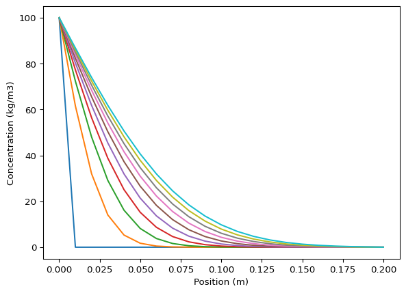
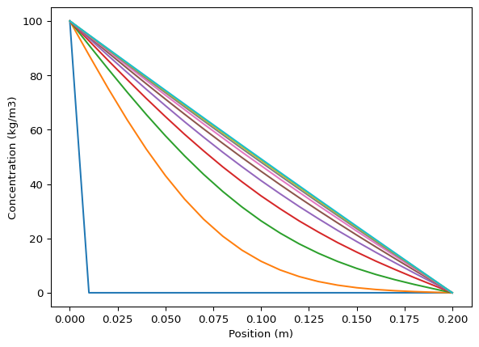
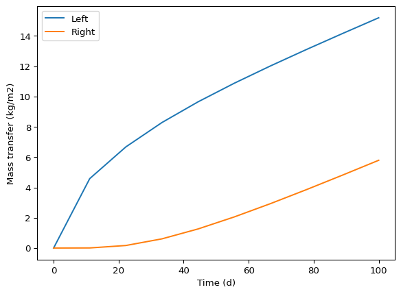
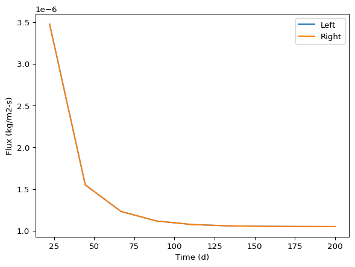
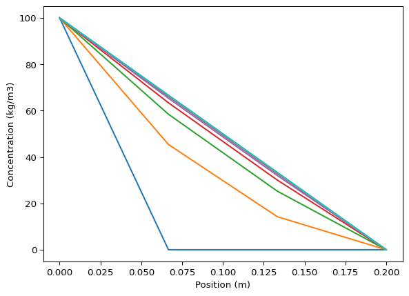
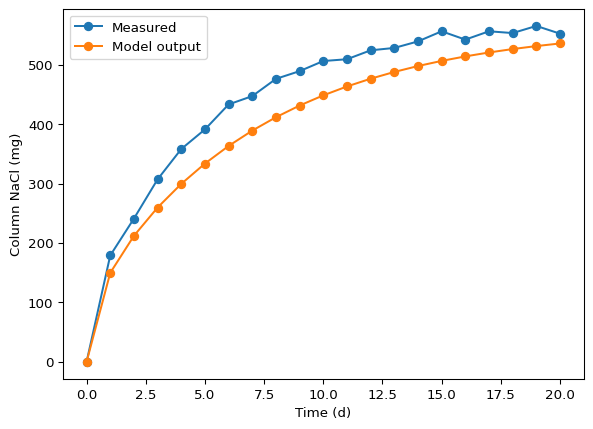

# 1D diffusion model solution
Sasha D. Hafner

1.  Qualitatively describe what you expect this model predict, both
    after short and then long periods of time.

**Solution**

Here I will assume that the column contains no NaCl at time 0, that the
left boundary concentration is high (say, 100 kg/m3), and that the right
0. After a short period of time there should be a steep NaCl
concentration gradient at the left side but concentrations still close
to zero toward the right. As time goes on that concentration profile
curves flattens out, eventually becoming a straight line after some long
period of time. In the ASCII diagrams below the concentration profile is
shown with dots.

    Initial:
           --------------------------
           |                        |
       c_l |                        | c_r
     ^     |                        |       
     |     |........................|
    c|     --------------------------
           x -->

    Short time:
           --------------------------
           |.                       |
       c_l |.                       | c_r
     ^     | .                      |       
     |     |  ......................|
    c|     --------------------------
           x -->

    Long time:
           --------------------------
           |.                       |
       c_l |        .               | c_r
     ^     |                 .      |       
     |     |                       .|
    c|     --------------------------
           x -->

2.  Given what you know about Fick’s law of diffusion at steady-state in
    a plane wall, predict the steady-state flux of the solute without
    the model, and then compare your expected value to model
    predictions.

**Solution**

In a plane wall at steady-state Fick’s law predicts a uniform flux
(going in, coming out, and at all points between) proportional to the
difference in concentrations at the boundaries:

$$
J = D \cdot \frac{\Delta c}{L}. 
$$

In the equation, $J$ is flux (kg/m2-s), $D$ diffusivity (m2/s),
$\Delta c$ concentration difference (kg/m3), and $L$ column (or wall,
etc.) thickness, i.e., the distance between the two boundaries (m). (You
can check the units in the `diff_mods` module.)

We can use this form of Fick’s law to calculate the expected
steady-state flux. We’ll use the inputs from the demo.

``` python
L = 0.2
D = 2.1E-9
bc = [100, 0]
```

``` python
D * (bc[0] - bc[1]) / L
```

    1.0500000000000001e-06

So we get 1.05E-6 kg/m2-s.

What does the model predict? So far in the demo we have just looked at
the predicted concentrations. But if you look in the `diff1D()` function
docstring you’ll see:

        Returns
        -------
        dictionary
            With time (t, s), cell width (dx, m), cell center position 
            (x, m), concentration profile (c, kg/m3), and cumulative 
            mass transfer at left and right boundaries (ml, mr, kg/m2).
        """

These cumulative mass transfer outputs `ml` and `mr` should be helpful
for verification of mass balance. At steady state the rate of change in
cumulative mass transfer should become constant, because the flux should
become constant. Following the discussion above, the flux should also be
same at the left and right boundaries at steady state. So we can use the
slope of the cumulative mass transfer outputs to calculate flux, as long
as we ensure the system is indeed predicted to be at steady state. We’ll
start by running the model for 10 days. First, load packages.

``` python
# Packages
import numpy as np
import matplotlib.pyplot as plt
from importlib import reload
import pandas as pd

# And our model functions
import diff_mods as dm
```

And the model call.

``` python
pred01 = dm.diff1D(L = 0.2,
                   n = 20,
                   D = 2.1E-9,
                   bc = [100, 0],
                   ci = 0,
                   t_eval = np.linspace(0, 10 * 86400, 10))
```

Plot profiles

``` python
plt.close()
for i in range(10): 
    plt.plot(pred01['x'], pred01['c'][:, i], label = pred01['t'][i])


plt.xlabel('Position (m)')
plt.ylabel('Concentration (kg/m3)')
plt.show()
plt.savefig('plots/profiles01.png')
```



    <Figure size 672x480 with 0 Axes>

That is not nearly enough–we can tell because the profile is not yet
linear.

``` python
pred02 = dm.diff1D(L = 0.2,
                   n = 20,
                   D = 2.1E-9,
                   bc = [100, 0],
                   ci = 0,
                   t_eval = np.linspace(0, 100 * 86400, 10))
```

Plot profiles.

``` python
plt.close()
for i in range(10): 
    plt.plot(pred02['x'], pred02['c'][:, i], label = pred02['t'][i])


plt.xlabel('Position (m)')
plt.ylabel('Concentration (kg/m3)')
plt.show()
plt.savefig('plots/profiles02.png')
```



    <Figure size 672x480 with 0 Axes>

That seems plenty long. What do the mass transfer variables look like?

``` python
plt.close()
plt.plot(pred02['t']/86400, pred02['ml'], label = 'Left')
plt.plot(pred02['t']/86400, pred02['mr'], label = 'Right')
plt.xlabel('Time (d)')
plt.ylabel('Mass transfer (kg/m2)')
plt.legend()
plt.show()
plt.savefig('plots/mass_transfer02.png')
```



    <Figure size 672x480 with 0 Axes>

And how about flux? We’ll calculate it from differences between adjacent
output times.

``` python
jl = (pred02['ml'][1:] - pred02['ml'][:-1]) / (pred02['t'][1:] - pred02['t'][:-1])
jr = (pred02['ml'][1:] - pred02['ml'][:-1]) / (pred02['t'][1:] - pred02['t'][:-1])
```

``` python
jl
jr
```

    array([4.77306333e-06, 2.18125145e-06, 1.67690719e-06, 1.42344903e-06,
           1.27619211e-06, 1.18752696e-06, 1.13370306e-06, 1.10094446e-06,
           1.08101092e-06])

We can see average fluxes (average over an output time interval) have
not quite stabilized after 100 d. So let’s try an even longer period.

``` python
pred03 = dm.diff1D(L = 0.2,
                   n = 20,
                   D = 2.1E-9,
                   bc = [100, 0],
                   ci = 0,
                   t_eval = np.linspace(0, 200 * 86400, 10))
```

And how about flux? We’ll calculate it from differences between adjacent
output times.

``` python
jl = (pred03['ml'][1:] - pred03['ml'][:-1]) / (pred03['t'][1:] - pred03['t'][:-1])
jr = (pred03['ml'][1:] - pred03['ml'][:-1]) / (pred03['t'][1:] - pred03['t'][:-1])
```

``` python
jl
jr
```

    array([3.47715739e-06, 1.55017811e-06, 1.23185954e-06, 1.11732376e-06,
           1.07494243e-06, 1.05923566e-06, 1.05343443e-06, 1.05125804e-06,
           1.05047782e-06])

``` python
plt.close()
plt.plot(pred03['t'][1:] / 86400, jl, label = 'Left')
plt.plot(pred03['t'][1:] / 86400, jr, label = 'Right')
plt.xlabel('Time (d)')
plt.ylabel('Flux (kg/m2-s)')
plt.legend()
plt.show()
plt.savefig('plots/flux03.png')
```



    <Figure size 672x480 with 0 Axes>

These values look stable, and match the simple calculation. So that
provides us with a little model verification.

Note: for understanding the model function code, the `diff1Db()` version
is a good starting place. This function does not have cumulative mass
transfer–that is what makes it simpler.

``` python
reload(dm)
pred03b = dm.diff1Db(L = 0.2,
                     n = 3,
                     D = 2.1E-9,
                     bc = [100, 0],
                     ci = 0,
                     t_eval = np.linspace(0, 200 * 86400, 10))
pred03b
```

    {'t': array([       0.,  1920000.,  3840000.,  5760000.,  7680000.,  9600000.,
            11520000., 13440000., 15360000., 17280000.]),
     'dx': array([0.03333333, 0.06666667, 0.06666667, 0.03333333]),
     'x': array([0.        , 0.06666667, 0.13333333, 0.2       ]),
     'c': array([[100.        , 100.        , 100.        , 100.        ,
             100.        , 100.        , 100.        , 100.        ,
             100.        , 100.        ],
            [  0.        ,  45.38865653,  58.44281204,  63.37500595,
              65.33310795,  66.12539269,  66.46046469,  66.58420146,
              66.63451123,  66.62802123],
            [  0.        ,  14.24617847,  25.26327908,  30.05016726,
              32.008916  ,  32.80513884,  33.09974408,  33.23796874,
              33.29359784,  33.34282442],
            [  0.        ,   0.        ,   0.        ,   0.        ,
               0.        ,   0.        ,   0.        ,   0.        ,
               0.        ,   0.        ]])}

``` python
plt.close()
for i in range(10): 
    plt.plot(pred03b['x'], pred03b['c'][:, i], label = pred03b['t'][i])


plt.xlabel('Position (m)')
plt.ylabel('Concentration (kg/m3)')
plt.show()
plt.savefig('plots/profiles03b.png')
```



    <Figure size 672x480 with 0 Axes>

3.  Can you use the output from the `diff1D()` to verify implementation
    of mass balance in the model? Check the function docstring (look at
    the module file contents or run `help(diff1D)` in Python) to check
    function parameters and outputs. This is meant to be a quick check,
    and not a detailed verification, but it is still good practice to
    keep a record of your function calls, output, and interpretation.
    That could be done in many ways, including a Markdown document or
    `*.txt` file with code and output (manually pasted in), or an MS
    Word file, a Jupyter Notebook file, or a Quarto Markdown (`q.md`)
    file.

**Solution**

Here is the mass balance equation we should verify:

    accumulation = flow in - flow out

That is for the entire column. It might have been nice of me to provide
that in the exercise document, but you should be able to quickly come up
with it for this simple system. As suggested in the exercise, let’s run
the model with fewer cells and fewer times just to make sure we
understand the output. Here we have only 3 cells and 2 times.

``` python
pred03 = dm.diff1D(L = 0.2,
                   n = 4,
                   D = 2.1E-9,
                   bc = [100, 0],
                   ci = 0,
                   t_eval = [0, 10 * 86400])
```

``` python
pred03
pred03['c']
```

    array([[100.        , 100.        ],
           [  0.        ,  40.63246549],
           [  0.        ,  11.41633217],
           [  0.        ,   2.34326154],
           [  0.        ,   0.        ]])

This clearly shows that our `c` (concentration) element is an array with
time across columns and position down rows. So here are all the cells
for the final (second) time:

``` python
pred03['c'][:, 1]
```

    array([100.        ,  40.63246549,  11.41633217,   2.34326154,
             0.        ])

These are concentrations. To get total mass (really kg/m2), we need to
multiply by cell thickness, which is conveniently included in the
output.

``` python
pred03['c'][:, 1] * pred03['dx']
```

    array([2.5       , 2.03162327, 0.57081661, 0.11716308, 0.        ])

So that gives us concentration times cell thickness, `g/m3 * m`, so it
is mass per m2 cross-sectional or boundary surface area, kg/m2. We can
take the sum for total accumulation, the left hand side (LHS) of the
mass balance equation we are hoping to verify.

``` python
accum = sum(pred03['c'][:, 1] * pred03['dx'])
accum
```

    np.float64(5.219602960064639)

That’s 4.298 kg/m2.

The model gives these values for mass transfer through the boundaries.

``` python
ml = pred03['ml'][1]
ml
mr = pred03['mr'][1]
mr
```

    np.float64(0.02601356941837238)

So let’s check the mass balance.

``` python
ml - mr
accum
accum - (ml - mr)
```

    np.float64(2.5000000000000004)

It looks fine.

But we used very few cells.

``` python
pred04 = dm.diff1D(L = 0.2,
                   n = 50,
                   D = 2.1E-9,
                   bc = [100, 0],
                   ci = 0,
                   t_eval = [0, 10 * 86400])
```

``` python
accum = sum(pred04['c'][:, 1] * pred04['dx'])
accum
```

    np.float64(4.806126798488524)

We get a slightly different value, caused by the change in
discretization. Take this as a reminder that discretization affects
results, and we should generally have enough (and small enough) cells
that accuracy is not compromised.

``` python
ml = pred04['ml'][1]
mr = pred04['mr'][1]
accum - (ml - mr)
```

    np.float64(0.20000000000000107)

That looks fine.

Let’s check it for both shorter and longer durations. First one hour.

``` python
pred05 = dm.diff1D(L = 0.2,
                   n = 50,
                   D = 2.1E-9,
                   bc = [100, 0],
                   ci = 0,
                   t_eval = [0, 3600])

accum = sum(pred05['c'][:, 1] * pred05['dx'])
ml = pred05['ml'][1]
mr = pred05['mr'][1]
accum - (ml - mr)
```

    np.float64(0.2)

Looks good.

``` python
pred06 = dm.diff1D(L = 0.2,
                   n = 50,
                   D = 2.1E-9,
                   bc = [100, 0],
                   ci = 0,
                   t_eval = [0, 100 * 86400])

accum = sum(pred06['c'][:, 1] * pred06['dx'])
ml = pred06['ml'][1]
mr = pred06['mr'][1]
accum - (ml - mr)
```

    np.float64(0.19999999999998685)

That also looks good.

Let’s try a different version of the model that uses a cell-based
approach.

``` python
pred06b = dm.diff1Dc(L = 0.2,
                   n = 50,
                   D = 2.1E-9,
                   bc = [100, 0],
                   ci = 0,
                   t_eval = [0, 100 * 86400])
accum = sum(pred06b['c'][:, 1] * pred06b['dx'])
ml = pred06['ml'][1]
mr = pred06['mr'][1]
accum - (ml - mr)
```

    np.float64(0.19990994580357047)

4.  See the data file `col_salt.csv` for some (fabricated) measurements
    of the total salt (NaCl here) mass within a 0.1 m long column with a
    diameter of 0.02 m. Fixed salt concentrations at the boundaries were
    36 kg/m3 at the left and zero at the right. Use the measurements to
    validate the model graphically and with relevant model fit
    statistics. The diffusivity of NaCl in water is known to be around
    1.6E-9 m2/s. What do you think about the accuracy of the model?
    Hint: Be careful with units and variables. You have to convert model
    predictions to the variable that was measured.

**Solution**

Let’s start by looking at the measurement data. We’ll use pandas.

``` python
measdat = pd.read_csv('data/col_salt.csv')
measdat
```

<div>
<style scoped>
    .dataframe tbody tr th:only-of-type {
        vertical-align: middle;
    }
&#10;    .dataframe tbody tr th {
        vertical-align: top;
    }
&#10;    .dataframe thead th {
        text-align: right;
    }
</style>

|     | time_d | salt_mg |
|-----|--------|---------|
| 0   | 0      | 0       |
| 1   | 1      | 179     |
| 2   | 2      | 241     |
| 3   | 3      | 307     |
| 4   | 4      | 358     |
| 5   | 5      | 391     |
| 6   | 6      | 433     |
| 7   | 7      | 447     |
| 8   | 8      | 476     |
| 9   | 9      | 489     |
| 10  | 10     | 506     |
| 11  | 11     | 509     |
| 12  | 12     | 524     |
| 13  | 13     | 528     |
| 14  | 14     | 539     |
| 15  | 15     | 556     |
| 16  | 16     | 542     |
| 17  | 17     | 556     |
| 18  | 18     | 553     |
| 19  | 19     | 565     |
| 20  | 20     | 552     |

</div>

Seems we have even 1 d spacing in time, which is convenient.

We’ll use the cell-based model in `diff1Dc()`, only because then each
cell as the same dx, making calculations easier for all times. So here
is our model call.

``` python
pred07 = dm.diff1Dc(L = 0.1,
                    n = 50,
                    D = 1.6E-9,
                    bc = [36, 0],
                    ci = 0,
                    t_eval = np.linspace(0, 20 * 86400, 21))
```

And we can use the same concept that we used above for calculating
accumulation. But, now we have to calculate it for all times, and we
need to then multiply by cross-sectional area in order to get total mass
of accumulated NaCl. We’ll use the NumPy `sum()` function, which can sum
over array dimensions (so give us separate sums for each time). We will
need the cross-sectional area.

``` python
area = np.pi * (0.02 / 2)**2 
area
```

    0.0003141592653589793

The `numpy.sum()` function accepts an axis parameter (second parameter).
The help file doesn’t really illuminate how to set it, but with
experimentation you can figure out how to add up all the columns, so you
have one sum per time.

``` python
salt_mod = (pred07['c'] * pred07['dx'] * area).sum(0)
salt_mod
```

    array([0.        , 0.00014977, 0.000212  , 0.00025964, 0.00029939,
           0.00033354, 0.00036318, 0.00038899, 0.0004115 , 0.00043113,
           0.00044826, 0.00046321, 0.00047625, 0.00048763, 0.00049756,
           0.00050622, 0.00051377, 0.00052037, 0.00052612, 0.00053114,
           0.00053552])

Units here are kg, and the measurement data are in mg. And time there is
in h.

If we are sure that we used the right times in the model call, we could
just add a column with model output. We’ll start with that. First, make
a new data frame that will hold measurements and model output.

``` python
mmdat = measdat.copy()
```

And add the model output we processed above.

``` python
mmdat['salt_mod_mg'] = salt_mod * 1E6
mmdat
```

<div>
<style scoped>
    .dataframe tbody tr th:only-of-type {
        vertical-align: middle;
    }
&#10;    .dataframe tbody tr th {
        vertical-align: top;
    }
&#10;    .dataframe thead th {
        text-align: right;
    }
</style>

|     | time_d | salt_mg | salt_mod_mg |
|-----|--------|---------|-------------|
| 0   | 0      | 0       | 0.000000    |
| 1   | 1      | 179     | 149.773978  |
| 2   | 2      | 241     | 212.002236  |
| 3   | 3      | 307     | 259.642982  |
| 4   | 4      | 358     | 299.389395  |
| 5   | 5      | 391     | 333.537495  |
| 6   | 6      | 433     | 363.175828  |
| 7   | 7      | 447     | 388.989435  |
| 8   | 8      | 476     | 411.498665  |
| 9   | 9      | 489     | 431.133657  |
| 10  | 10     | 506     | 448.264052  |
| 11  | 11     | 509     | 463.210089  |
| 12  | 12     | 524     | 476.250485  |
| 13  | 13     | 528     | 487.628038  |
| 14  | 14     | 539     | 497.555009  |
| 15  | 15     | 556     | 506.216288  |
| 16  | 16     | 542     | 513.773309  |
| 17  | 17     | 556     | 520.366726  |
| 18  | 18     | 553     | 526.119486  |
| 19  | 19     | 565     | 531.138819  |
| 20  | 20     | 552     | 535.518175  |

</div>

We can already seen the order or magnitude is OK.

But it is safer to do a proper merge. For that we need to combine model
time and our response variable. And it is easiest to merge in a
DataFrame, so we’ll do that.

``` python
moddat = pd.DataFrame({
    'time_d': pred07['t'] / 86400,
    'salt_mod_mg': salt_mod * 1E6
})

moddat
```

<div>
<style scoped>
    .dataframe tbody tr th:only-of-type {
        vertical-align: middle;
    }
&#10;    .dataframe tbody tr th {
        vertical-align: top;
    }
&#10;    .dataframe thead th {
        text-align: right;
    }
</style>

|     | time_d | salt_mod_mg |
|-----|--------|-------------|
| 0   | 0.0    | 0.000000    |
| 1   | 1.0    | 149.773978  |
| 2   | 2.0    | 212.002236  |
| 3   | 3.0    | 259.642982  |
| 4   | 4.0    | 299.389395  |
| 5   | 5.0    | 333.537495  |
| 6   | 6.0    | 363.175828  |
| 7   | 7.0    | 388.989435  |
| 8   | 8.0    | 411.498665  |
| 9   | 9.0    | 431.133657  |
| 10  | 10.0   | 448.264052  |
| 11  | 11.0   | 463.210089  |
| 12  | 12.0   | 476.250485  |
| 13  | 13.0   | 487.628038  |
| 14  | 14.0   | 497.555009  |
| 15  | 15.0   | 506.216288  |
| 16  | 16.0   | 513.773309  |
| 17  | 17.0   | 520.366726  |
| 18  | 18.0   | 526.119486  |
| 19  | 19.0   | 531.138819  |
| 20  | 20.0   | 535.518175  |

</div>

Now merge.

``` python
mmdat2 = pd.merge(measdat, moddat, on = 'time_d')

mmdat2
```

<div>
<style scoped>
    .dataframe tbody tr th:only-of-type {
        vertical-align: middle;
    }
&#10;    .dataframe tbody tr th {
        vertical-align: top;
    }
&#10;    .dataframe thead th {
        text-align: right;
    }
</style>

|     | time_d | salt_mg | salt_mod_mg |
|-----|--------|---------|-------------|
| 0   | 0      | 0       | 0.000000    |
| 1   | 1      | 179     | 149.773978  |
| 2   | 2      | 241     | 212.002236  |
| 3   | 3      | 307     | 259.642982  |
| 4   | 4      | 358     | 299.389395  |
| 5   | 5      | 391     | 333.537495  |
| 6   | 6      | 433     | 363.175828  |
| 7   | 7      | 447     | 388.989435  |
| 8   | 8      | 476     | 411.498665  |
| 9   | 9      | 489     | 431.133657  |
| 10  | 10     | 506     | 448.264052  |
| 11  | 11     | 509     | 463.210089  |
| 12  | 12     | 524     | 476.250485  |
| 13  | 13     | 528     | 487.628038  |
| 14  | 14     | 539     | 497.555009  |
| 15  | 15     | 556     | 506.216288  |
| 16  | 16     | 542     | 513.773309  |
| 17  | 17     | 556     | 520.366726  |
| 18  | 18     | 553     | 526.119486  |
| 19  | 19     | 565     | 531.138819  |
| 20  | 20     | 552     | 535.518175  |

</div>

Finally, let’s plot the results for comparison.

``` python
plt.close()
plt.plot(mmdat2.time_d, mmdat2.salt_mg, marker = 'o', label = 'Measured')
plt.plot(mmdat2.time_d, mmdat2.salt_mod_mg, marker = 'o', label = 'Model output')
plt.xlabel('Time (d)')
plt.ylabel('Column NaCl (mg)')
plt.legend()
plt.show()
plt.savefig('plots/salt_val07.png')
```



    <Figure size 672x480 with 0 Axes>

Well, clearly the model underestimates NaCl accumulation, even if we
consider that there is some random error in measurements (see it?). But
measurements and the model both show the same shape and are not terribly
far off.

We can get quantitative using the model fit statistics we discussed in
class on Thursday. Let’s load the module.

``` python
import mod_fit as mf
```

First mean bias.

``` python
mf.mbe(mmdat.salt_mg, mmdat.salt_mod_mg)
```

    np.float64(-42.657897805438154)

So that’s a mean bias of under 10% of the maximum. That would not be
terrible for an environmental model, but depending on the application,
better accuracy might be needed.

Mean absolute error is similar.

``` python
mf.mae(mmdat.salt_mg, mmdat.salt_mod_mg)
```

    np.float64(42.657897805438154)

Not surprising, from looking at the plot, which shows that most of the
error is related to bias.

5.  Editing mass transfer output

See `diff1D2()` function in the module. Here we will compare it to the
original. Remember to `reload()` after editing the module!

``` python
reload(dm)
```

    <module 'diff_mods' from '/home/sasha/GitHub_repos/course-modelling-2025-private/classes/17_28_oct/solutions/diff_mods.py'>

``` python
pred04 = dm.diff1Dc(L = 0.2,
                   n = 5,
                   D = 2.1E-9,
                   bc = [100, 0],
                   ci = 0,
                   t_eval = [0, 10 * 86400])
```

``` python
sum(pred04['c'][:, 1] * pred04['dx'])
```

    np.float64(4.500236075952478)

``` python
pred04['ml'][1]
```

    np.float64(4.508424115775842)

``` python
pred04['mr'][1]
```

    np.float64(0.00818803982336452)

``` python
pred05 = dm.diff1Dd(L = 0.2,
                    n = 5,
                    D = 2.1E-9,
                    bc = [100, 0],
                    ci = 0,
                    t_eval = [0, 10 * 86400])
```

``` python
sum(pred05['c'][:, 1] * pred05['dx'])
```

    np.float64(4.500236075952478)

``` python
pred05['ml'][1]
```

    np.float64(4.508424115775842)

``` python
pred05['mr'][1]
```

    np.float64(-0.00818803982336452)

Now `mr` is negative, indicating flow *out*.

6.  Using loops instead of clever indexing (or vice versa!)

See `diff1Dc()` and `diff1De()` function.

``` python
reload(dm)
```

    <module 'diff_mods' from '/home/sasha/GitHub_repos/course-modelling-2025-private/classes/17_28_oct/solutions/diff_mods.py'>

``` python
pred06 = dm.diff1Dc(L = 0.2,
                    n = 5,
                    D = 2.1E-9,
                    bc = [100, 0],
                    ci = 0,
                    t_eval = [0, 10 * 86400])
```

``` python
pred06['c'][:, 1] 
```

    array([71.39044994, 29.21487205,  9.19271769,  2.30821226,  0.39964997])

``` python
pred06['ml'][1]
```

    np.float64(4.508424115775842)

``` python
pred06['mr'][1]
```

    np.float64(0.00818803982336452)

``` python
reload(dm)

pred07 = dm.diff1De(L = 0.2,
                        n = 5,
                        D = 2.1E-9,
                        bc = [100, 0],
                        ci = 0,
                        t_eval = [0, 10 * 86400])
```

``` python
pred07['c'][:, 1] 
```

    array([71.39044994, 29.21487205,  9.19271769,  2.30821226,  0.39964997])

``` python
pred07['ml'][1]
```

    np.float64(4.508424115775842)

``` python
pred07['mr'][1]
```

    np.float64(0.00818803982336452)

They look the same. We can check for equality.

``` python
np.allclose(pred06['c'], pred07['c'])
```

    True

``` python
np.allclose(pred06['ml'], pred07['ml'])
```

    True

``` python
np.allclose(pred06['mr'], pred07['mr'])
```

    True
