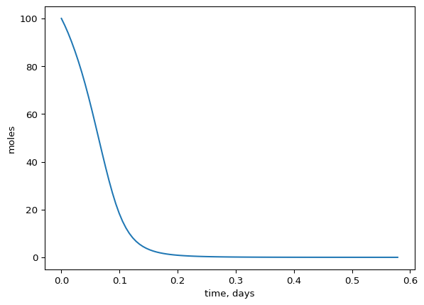
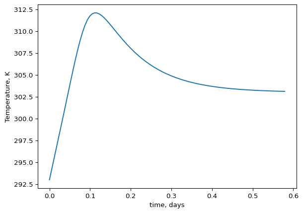

Exercises - Coupled mass and heat transfer

1.  Decomposition of $2H_{2}O_{2} \rightarrow 2H_{2}O + O_{2}$ is an
    exothermic reaction that occurs in water. The reaction takes place
    in a batch reactor and follows first order kinetics. The rate
    constant is temperature dependent like this:

$$k(T) = A \times exp(-\frac{E_{a}}{RT})$$

The batch reactor is cooled by a cooling jacket with ambient water
temperature $T_c$ of 20 deg C. The surface area between the cooling
jacket and the reactor is 1 $m^2$. A stirrer ensures that the reactor is
perfectly mixed.

$$
E_{a} = 8 \times 10^{4} \; J/mol
$$

$$
A = 1 \times 10^{10} \; s^{-1}
$$

$$
R = 8.314\ \mathrm{J/(mol \cdot K)}
$$

$$
\Delta H_{rxn} = -98 \cdot 10^3\ \mathrm{J/mol}
$$

$$
C_{p,water}= 4180\ \mathrm{J/(L \cdot K)}
$$

$$
\rho = 1000 \; kg/m^{3} 
$$

$$
q_{stirrer} = 5000 \; J/(s \cdot m^{3})
$$

$$
T_{0} = 293 \; K
$$

The reactor working volume is 100 L and with an initial concentration of
1 mol/L of $H_{2}O_{2}$ in an aqueous solution. The heat from the
reactor is removed with an overall heat transfer coefficient of

$$
U = 50\; J/(s \cdot m^{2} \cdot K)
$$

A\) Write the heat and mass balance for the reactor.

Solution: Since the reactor is mixed we can use the approach for 0D. Or
we can use the 1D balance found in Rasmuson et al. Appendix A1 and then
reduce it to 0D.

$$
\rho \cdot C_p \left( \frac{\partial T}{\partial t} + v_x \frac{\partial T}{\partial x} + v_y \frac{\partial T}{\partial y} + v_z \frac{\partial T}{\partial z} \right) = k \left( \frac{\partial^2 T}{\partial x^2} + \frac{\partial^2 T}{\partial y^2} + \frac{\partial^2 T}{\partial z^2} \right) + S
$$

Then we cross out terms. There is no in or outflow (batch reactor) and
it is perfectly mixed (no heat conduction or unidirectional advection).
And we are left with only S. Cp is given in units of J/(L K), but it is
water and we know 1 L is equivalent to 1 kg. Therefore we will use Cp in
units of J/(kg K).

$$
\rho \cdot C_p \frac{\partial T}{\partial t} = S
$$

The S (source) is generated and removed heat combined. Lets check units
here:

$$
kg/m3 \cdot J/(kg K) \cdot K/s = J/(m3 \cdot s)
$$

So S has units per volume currently. We will deal with that in a moment.
We know the reaction and the stirrer produces heat and that heat is
removed through a cooling jacket. That is three different processes that
S currently represents and we need to be explicit about those processes
now. We are given U, which is an overall heat transfer coefficient that
is really made up of other conductivity and transfer coefficients. We
are told the heat is lost across the cooling jacket, which has another
temperature than the reactor solution. We should now realize that this
temperature gradient drives the heat transfer and think newtons law of
cooling! We only care about the overall heat transfer coefficient and we
don’t need to know h and k as it is all combined in U. We can use
newtons law of cooling for the heat loss across the cooling jacket. We
also have energy added from the stirrer, which has units of J/(m3 s)
already. Finally we have the heat generated from the reaction. The
reaction rate r has units of mol/(m3 s) and when we multiply that with
the enthalpy of reaction (J/mol) we get J/(m3 s) as well. Perfect, all
terms in S have the same units now. Or do they?

Wait, we have U in units of J/(s m2 K) and the temperature difference in
K. When we multiply those two we get J/(s m2). So this mechanism is not
related to volume, but the surface area of the reactor, but we need it
to be converted to J/(s \* m3) to match the other terms. The m2 refers
to the surface area between the cooling jacket and reactor solution. We
can convert U to J/(s m3) by multiplying by the surface area and
dividing by the volume of the reactor.

Therefore we can rewrite S as a combination of the heat of reaction and
heat loss through the cooling jacket.

$$
\rho \cdot C_p \frac{\partial T}{\partial t} = Q_\mathrm{gen} - Q_\mathrm{removal} = -\Delta H_{rxn}\, k \cdot C_{A} + q_{stirrer} - U \cdot A_{jacket} \cdot (T - T_c)/V
$$

Finally we can multiply everything by the volume to get the energy
balance on the whole reactor rather than pr volume and we can also
divide by rho \* Cp to isolate dTdt, which is what we are really after!
Lets do that

$$
\frac{\partial T}{\partial t} = \frac{-\Delta H_{rxn}\, k \cdot C_{A} \cdot V + q_{stirrer} \cdot V - U \cdot A_{jacket} \cdot (T - T_c)}{\rho \cdot C_p \cdot V}
$$

Simplifying a bit more and we get the final governing equation for the
heat balance:

$$
\frac{\partial T}{\partial t} = \frac{-\Delta H_{rxn}\, k \cdot C_{A} + q_{stirrer}}{\rho \cdot C_p} - \frac{U \cdot A_{jacket} \cdot (T - T_c)}{\rho \cdot C_p \cdot V}
$$

The mass or mole balance is simple and we can remove most terms from the
one given in Appendix A in Rasmuson again, this results in

$$
\frac{\partial C}{\partial t} = -r 
$$

Where $r$ is the reaction which converts the $H_{2}O_{2}$ to the
products.

$$ 
\frac{\partial C_A}{\partial t} = k \cdot C_{A}
$$

Getting to a mass/mole balance instead of a concentration balance (if we
want that?), we simply multiply by V on both sides.

$$ 
\frac{\partial N}{\partial t} = k \cdot C_{A} \cdot V
$$

Remember that for both the mass and heat balance we could have kept as
pr. volume instead of for the whole reactor.

B\) Setup the model in python and try to run it. The reaction product
should not exceed 305 K. try to accomplish that by adjusting the overall
mass transfer coefficient (U). How could the over all mass transfer
coefficient be increased in practice?

``` python
import numpy as np
from scipy.integrate import solve_ivp
import matplotlib.pyplot as plt
# define constants

T0 = 293 # K
T_c = 293 # K
c0 = 1000 # mol/m3
Ea = 8*10**4 # J/mol
A = 1e10 # s^-1
Delta_H =  -98 * 10**3 # J/mol
Q_stirrer = 5000 # J/(s*m3)
R = 8.314 # J/(mol*K)
V = 0.100 # m3
U = 0.5* 10**2 # J/(s*m2*K) # increase to 100 J/(s*K) to get below 305 K
A_jacket = 1 # m2
Cp = 4180 # J/(kg*K)
rho = 1000 # kg/m3

# It is easier to use moles rather than mass when we have c0 in mole/m3 already.
# but this is up to the user.
n0 = c0 * V

tmax = 50000
y0 = np.array([n0, T0])

def rates(t, y, T_c, Ea, A, R, V, U, Cp, rho, Q_stirrer, Delta_H, A_jacket):
  
  # extracting derivatives to make it more transparant what is going on
  n = y[0]
  T = y[1]
  
  c = n/V
  # the rate constant depends on the state variable T
  k = A * np.exp(-Ea/(R*T)) # 1/s
  # reaction rate
  ra = -k * c # moles/(m3 * s)
  # batch reactor has only reaction in the mass balance
  dndt = ra * V # for whole tank (multiplying by V) # moles/s
  # energy balance
  q_rxn_total = Delta_H * ra * V # for whole tank, J/s 
  Q_stirrer_total = Q_stirrer * V # J/s
  Q_loss_total = U * A_jacket * (T - T_c) # J/s
  
  m = V * rho # total mass of reactor solution
  
  # Heat balance
  dTdt = (q_rxn_total + Q_stirrer_total - Q_loss_total)/(m * Cp) # 
  
  # putting together deriviatives in an array.
  dydt = np.array([dndt, dTdt])
  
  return dydt
  
  
t_span = [0, tmax]

sol = solve_ivp(rates, t_span, y0 = y0, method = 'BDF', t_eval = np.linspace(0, tmax, 100), args = (T_c, Ea, A, R, V, U, Cp, rho, Q_stirrer, Delta_H, A_jacket))

plt.ioff()
plt.plot(sol.t/(60*60*24), sol.y[0])
plt.xlabel('time, days')
plt.ylabel('moles')
plt.show()

plt.ioff()
plt.plot(sol.t/(60*60*24), sol.y[1])
plt.xlabel('time, days')
plt.ylabel('Temperature, K')
plt.show()

# increasing U to 10**3 reduces the temperature sufficiently to keep the reaction product stable
```




